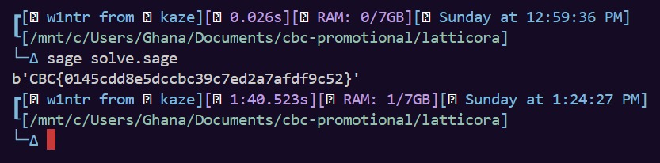

This article covers `latticora`, a cryptography challenge from **Cyber Breaker Competition Promotional 2026**, authored by **merricx**. The title sounds dramatic, but the challenge is not really about breaking post-quantum cryptography in the generic sense. It is about exploiting a very specific leakage pattern around an ML-KEM-512 instance until the rest of the scheme becomes solvable with linear algebra.

<figure><figcaption></figcaption></figure>

What follows is the path I used to recover the leaked error vector, turn the public key back into an LWE instance, and reconstruct the secret.

### Initial Analysis

The challenge gives us a long Python file. Most of it is not there to hide the bug, but to help us: polynomial helpers, NTT routines, key generation, encapsulation, decapsulation, and even helper functions for reconstructing decapsulation keys are already present. Well, here are the full code:

```python
from __future__ import annotations

import hashlib
import os
import random
from typing import Iterable

Q = 3329
N = 256
K = 2
ETA1 = 3
ETA2 = 2
DU = 10
DV = 4
SECRET_DIMENSION = K * N
ERROR_DIMENSION = K * N
EK_SIZE = 384 * K + 32
DK_SIZE = 768 * K + 96
CIPHERTEXT_SIZE = 32 * (DU * K + DV)
ZERO_Z = b"\x00" * 32
FLAG = open("flag.txt", "rb").read()

ZETAS = [pow(17, int(f"{i:07b}"[::-1], 2), Q) for i in range(128)]
NTT_F = pow(128, -1, Q)


def center_mod_q(x: int) -> int:
    x %= Q
    return x if x <= Q // 2 else x - Q


def xor_bytes(left: bytes, right: bytes) -> bytes:
    return bytes(a ^ b for a, b in zip(left, right))


def select_bytes(on_false: bytes, on_true: bytes, condition: bool) -> bytes:
    if len(on_false) != len(on_true):
        raise ValueError("select inputs must have equal length")
    mask = -int(condition) & 0xFF
    return bytes((a & ~mask) | (b & mask) for a, b in zip(on_false, on_true))


def h256(data: bytes) -> bytes:
    return hashlib.sha3_256(data).digest()


def g_hash(data: bytes) -> tuple[bytes, bytes]:
    out = hashlib.sha3_512(data).digest()
    return out[:32], out[32:]


def j_hash(data: bytes) -> bytes:
    return hashlib.shake_256(data).digest(32)


def shake256(label: bytes, out_len: int) -> bytes:
    return hashlib.shake_256(label).digest(out_len)


def xof(rho: bytes, i: int, j: int) -> bytes:
    if len(rho) != 32:
        raise ValueError("rho must be 32 bytes")
    return hashlib.shake_128(rho + bytes([i]) + bytes([j])).digest(840)


def prf(eta: int, sigma: bytes, nonce: int) -> bytes:
    if len(sigma) != 32:
        raise ValueError("sigma must be 32 bytes")
    return hashlib.shake_256(sigma + bytes([nonce])).digest(eta * 64)


def parse_hex_bytes(value: str, expected_len: int, name: str) -> bytes:
    text = value.strip()
    if text.startswith(("0x", "0X")):
        text = text[2:]
    try:
        out = bytes.fromhex(text)
    except ValueError as exc:
        raise ValueError(f"{name} must be hex encoded") from exc
    if len(out) != expected_len:
        raise ValueError(f"{name} must decode to {expected_len} bytes, got {len(out)}")
    return out


def key_material_from_seed(
    seed: str | None, message: str | None
) -> tuple[bytes, bytes]:
    if seed is None:
        key_seed = os.urandom(64)
    else:
        key_seed = parse_hex_bytes(seed, 64, "--seed")

    if message is None:
        encapsulation_message = os.urandom(32)
    else:
        encapsulation_message = parse_hex_bytes(message, 32, "--message")

    return key_seed, encapsulation_message


def byte_encode(coeffs: Iterable[int], d: int) -> bytes:
    coeffs = list(coeffs)
    if len(coeffs) != N:
        raise ValueError("expected 256 polynomial coefficients")
    acc = 0
    mask = (1 << d) - 1
    for i, coeff in enumerate(coeffs):
        acc |= (int(coeff) & mask) << (i * d)
    return acc.to_bytes(32 * d, "little")


def byte_decode(data: bytes, d: int) -> list[int]:
    if len(data) * 8 != N * d:
        raise ValueError("bad encoded polynomial length")
    modulus = Q if d == 12 else 1 << d
    mask = (1 << d) - 1
    acc = int.from_bytes(data, "little")
    coeffs = []
    for _ in range(N):
        coeffs.append((acc & mask) % modulus)
        acc >>= d
    return coeffs


def encode_vector(polys: list[list[int]], d: int) -> bytes:
    return b"".join(byte_encode(poly, d) for poly in polys)


def decode_vector(data: bytes, k: int, d: int) -> list[list[int]]:
    poly_len = 32 * d
    if len(data) != k * poly_len:
        raise ValueError("bad encoded vector length")
    return [
        byte_decode(data[i : i + poly_len], d) for i in range(0, len(data), poly_len)
    ]


def compress_coeff(x: int, d: int) -> int:
    return (((1 << d) * (x % Q) + Q // 2) // Q) % (1 << d)


def decompress_coeff(x: int, d: int) -> int:
    return (Q * x + (1 << (d - 1))) >> d


def compress_poly(poly: list[int], d: int) -> list[int]:
    return [compress_coeff(x, d) for x in poly]


def decompress_poly(poly: list[int], d: int) -> list[int]:
    return [decompress_coeff(x, d) for x in poly]


def poly_add(a: list[int], b: list[int]) -> list[int]:
    return [(x + y) % Q for x, y in zip(a, b)]


def poly_sub(a: list[int], b: list[int]) -> list[int]:
    return [(x - y) % Q for x, y in zip(a, b)]


def poly_zero() -> list[int]:
    return [0] * N


def ntt(poly: list[int]) -> list[int]:
    coeffs = poly[:]
    k = 1
    length = 128
    while length >= 2:
        start = 0
        while start < N:
            zeta = ZETAS[k]
            k += 1
            for j in range(start, start + length):
                t = zeta * coeffs[j + length]
                coeffs[j + length] = coeffs[j] - t
                coeffs[j] = coeffs[j] + t
            start += 2 * length
        length >>= 1
    return [c % Q for c in coeffs]


def inv_ntt(poly: list[int]) -> list[int]:
    coeffs = poly[:]
    length = 2
    k = 127
    while length <= 128:
        start = 0
        while start < N:
            zeta = ZETAS[k]
            k -= 1
            for j in range(start, start + length):
                t = coeffs[j]
                coeffs[j] = t + coeffs[j + length]
                coeffs[j + length] = zeta * (coeffs[j + length] - t)
            start += 2 * length
        length <<= 1
    return [(c * NTT_F) % Q for c in coeffs]


def ntt_base_mul(a0: int, a1: int, b0: int, b1: int, zeta: int) -> tuple[int, int]:
    return (a0 * b0 + zeta * a1 * b1) % Q, (a1 * b0 + a0 * b1) % Q


def ntt_mul(a: list[int], b: list[int]) -> list[int]:
    out = []
    for i in range(64):
        r0, r1 = ntt_base_mul(
            a[4 * i], a[4 * i + 1], b[4 * i], b[4 * i + 1], ZETAS[64 + i]
        )
        r2, r3 = ntt_base_mul(
            a[4 * i + 2],
            a[4 * i + 3],
            b[4 * i + 2],
            b[4 * i + 3],
            -ZETAS[64 + i],
        )
        out.extend([r0, r1, r2, r3])
    return out


def cbd(buf: bytes, eta: int) -> list[int]:
    if len(buf) != eta * 64:
        raise ValueError("bad CBD input length")
    acc = int.from_bytes(buf, "little")
    mask = (1 << eta) - 1
    mask2 = (1 << (2 * eta)) - 1
    coeffs = []
    for _ in range(N):
        x = acc & mask2
        a = (x & mask).bit_count()
        b = ((x >> eta) & mask).bit_count()
        coeffs.append((a - b) % Q)
        acc >>= 2 * eta
    return coeffs


def sample_ntt(buf: bytes) -> list[int]:
    coeffs = []
    i = 0
    while len(coeffs) < N:
        d1 = buf[i] + 256 * (buf[i + 1] % 16)
        d2 = (buf[i + 1] // 16) + 16 * buf[i + 2]
        if d1 < Q:
            coeffs.append(d1)
        if d2 < Q and len(coeffs) < N:
            coeffs.append(d2)
        i += 3
    return coeffs


def generate_matrix_from_seed(rho: bytes) -> list[list[list[int]]]:
    return [[sample_ntt(xof(rho, j, i)) for j in range(K)] for i in range(K)]


def generate_error_vector(
    sigma: bytes, eta: int, nonce: int
) -> tuple[list[list[int]], int]:
    polys = []
    for _ in range(K):
        polys.append(cbd(prf(eta, sigma, nonce), eta))
        nonce += 1
    return polys, nonce


def generate_error_poly(sigma: bytes, eta: int, nonce: int) -> tuple[list[int], int]:
    return cbd(prf(eta, sigma, nonce), eta), nonce + 1


def mat_vec_mul_ntt(
    matrix: list[list[list[int]]], vector: list[list[int]]
) -> list[list[int]]:
    out = []
    for row in range(K):
        acc = poly_zero()
        for col in range(K):
            acc = poly_add(acc, ntt_mul(matrix[row][col], vector[col]))
        out.append(acc)
    return out


def mat_t_vec_mul_ntt(
    matrix: list[list[list[int]]], vector: list[list[int]]
) -> list[list[int]]:
    out = []
    for row in range(K):
        acc = poly_zero()
        for col in range(K):
            acc = poly_add(acc, ntt_mul(matrix[col][row], vector[col]))
        out.append(acc)
    return out


def dot_ntt(left: list[list[int]], right: list[list[int]]) -> list[int]:
    acc = poly_zero()
    for a, b in zip(left, right):
        acc = poly_add(acc, ntt_mul(a, b))
    return acc


def k_pke_keygen(d: bytes) -> tuple[bytes, bytes]:
    if len(d) != 32:
        raise ValueError("K-PKE keygen seed d must be 32 bytes")
    rho, sigma = g_hash(d + bytes([K]))
    a_hat = generate_matrix_from_seed(rho)
    nonce = 0
    s, nonce = generate_error_vector(sigma, ETA1, nonce)
    e, nonce = generate_error_vector(sigma, ETA1, nonce)
    s_hat = [ntt(poly) for poly in s]
    e_hat = [ntt(poly) for poly in e]
    t_hat = [poly_add(x, y) for x, y in zip(mat_vec_mul_ntt(a_hat, s_hat), e_hat)]
    return encode_vector(t_hat, 12) + rho, encode_vector(s_hat, 12)


def key_derive(seed: bytes) -> tuple[bytes, bytes]:
    if len(seed) != 64:
        raise ValueError("ML-KEM key seed must be 64 bytes")
    ek, dk_pke = k_pke_keygen(seed[:32])
    return ek, dk_pke + ek + h256(ek) + seed[32:]


def keygen() -> tuple[bytes, bytes]:
    return key_derive(os.urandom(64))


def validate_encapsulation_key(ek: bytes) -> tuple[list[list[int]], bytes]:
    if len(ek) != EK_SIZE:
        raise ValueError(f"bad ML-KEM-512 encapsulation key length: expected {EK_SIZE}")
    t_hat_bytes = ek[: 384 * K]
    t_hat = decode_vector(t_hat_bytes, K, 12)
    if encode_vector(t_hat, 12) != t_hat_bytes:
        raise ValueError("ML-KEM encapsulation key modulus check failed")
    return t_hat, ek[384 * K :]


def k_pke_encrypt(ek: bytes, message: bytes, randomness: bytes) -> bytes:
    if len(message) != 32:
        raise ValueError("K-PKE plaintext message must be 32 bytes")
    if len(randomness) != 32:
        raise ValueError("K-PKE encryption randomness must be 32 bytes")
    t_hat, rho = validate_encapsulation_key(ek)
    a_hat = generate_matrix_from_seed(rho)

    nonce = 0
    y, nonce = generate_error_vector(randomness, ETA1, nonce)
    e1, nonce = generate_error_vector(randomness, ETA2, nonce)
    e2, nonce = generate_error_poly(randomness, ETA2, nonce)
    y_hat = [ntt(poly) for poly in y]

    u = [
        poly_add(inv_ntt(poly), err)
        for poly, err in zip(mat_t_vec_mul_ntt(a_hat, y_hat), e1)
    ]
    mu = decompress_poly(byte_decode(message, 1), 1)
    v = poly_add(poly_add(inv_ntt(dot_ntt(t_hat, y_hat)), e2), mu)

    return encode_vector([compress_poly(poly, DU) for poly in u], DU) + byte_encode(
        compress_poly(v, DV), DV
    )


def k_pke_decrypt(dk_pke: bytes, ciphertext: bytes) -> bytes:
    if len(dk_pke) != 384 * K:
        raise ValueError("bad K-PKE decryption key length")
    if len(ciphertext) != CIPHERTEXT_SIZE:
        raise ValueError(
            f"bad ML-KEM-512 ciphertext length: expected {CIPHERTEXT_SIZE}"
        )
    c1_len = 32 * DU * K
    c1, c2 = ciphertext[:c1_len], ciphertext[c1_len:]
    u = [decompress_poly(poly, DU) for poly in decode_vector(c1, K, DU)]
    v = decompress_poly(byte_decode(c2, DV), DV)
    s_hat = decode_vector(dk_pke, K, 12)
    w = poly_sub(v, inv_ntt(dot_ntt(s_hat, [ntt(poly) for poly in u])))
    return byte_encode(compress_poly(w, 1), 1)


def encaps_internal(ek: bytes, message: bytes) -> tuple[bytes, bytes]:
    if len(message) != 32:
        raise ValueError("ML-KEM encapsulation message must be 32 bytes")
    shared_secret, randomness = g_hash(message + h256(ek))
    return shared_secret, k_pke_encrypt(ek, message, randomness)


def encaps(ek: bytes) -> tuple[bytes, bytes]:
    return encaps_internal(ek, os.urandom(32))


def decaps(dk: bytes, ciphertext: bytes) -> bytes:
    if len(dk) != DK_SIZE:
        raise ValueError(f"bad ML-KEM-512 decapsulation key length: expected {DK_SIZE}")
    if len(ciphertext) != CIPHERTEXT_SIZE:
        raise ValueError(
            f"bad ML-KEM-512 ciphertext length: expected {CIPHERTEXT_SIZE}"
        )
    dk_pke = dk[: 384 * K]
    ek = dk[384 * K : 768 * K + 32]
    h = dk[768 * K + 32 : 768 * K + 64]
    z = dk[768 * K + 64 :]
    if h256(ek) != h:
        raise ValueError("bad decapsulation key hash")

    message = k_pke_decrypt(dk_pke, ciphertext)
    shared_secret, randomness = g_hash(message + h)
    fallback = j_hash(z + ciphertext)
    c_prime = k_pke_encrypt(ek, message, randomness)
    return select_bytes(fallback, shared_secret, c_prime == ciphertext)


def centered_secret_from_dk(dk: bytes) -> list[int]:
    s_hat = decode_vector(dk[: 384 * K], K, 12)
    secret = []
    for poly in s_hat:
        secret.extend(center_mod_q(c) for c in inv_ntt(poly))
    return secret


def decapsulation_key_from_centered_secret(
    secret_coeffs: Iterable[int],
    encapsulation_key: bytes,
    z: bytes = ZERO_Z,
) -> bytes:
    coeffs = list(secret_coeffs)
    if len(coeffs) != SECRET_DIMENSION:
        raise ValueError(f"expected {SECRET_DIMENSION} secret coefficients")
    if len(encapsulation_key) != EK_SIZE:
        raise ValueError(f"bad ML-KEM-512 encapsulation key length: expected {EK_SIZE}")
    if len(z) != 32:
        raise ValueError("z must be 32 bytes")
    s_hat = [ntt([c % Q for c in coeffs[i : i + N]]) for i in range(0, len(coeffs), N)]
    dk_pke = encode_vector(s_hat, 12)
    return dk_pke + encapsulation_key + h256(encapsulation_key) + z


def negacyclic_mul_coeff(multiplier: list[int], out_idx: int, secret_idx: int) -> int:
    idx = out_idx - secret_idx
    if idx >= 0:
        return multiplier[idx] % Q
    return (-multiplier[idx + N]) % Q


def mlkem512_lwe_instance_from_ek(
    encapsulation_key: bytes,
) -> tuple[list[list[int]], list[int], int]:
    t_hat, rho = validate_encapsulation_key(encapsulation_key)
    t = [inv_ntt(poly) for poly in t_hat]
    a_coeff = [
        [inv_ntt(poly) for poly in row] for row in generate_matrix_from_seed(rho)
    ]

    samples = K * N
    lwe_a = [[0 for _ in range(samples)] for _ in range(SECRET_DIMENSION)]
    lwe_b = [0 for _ in range(samples)]
    for public_poly_idx in range(K):
        for out_idx in range(N):
            sample_idx = public_poly_idx * N + out_idx
            lwe_b[sample_idx] = t[public_poly_idx][out_idx] % Q
            for secret_poly_idx in range(K):
                multiplier = a_coeff[public_poly_idx][secret_poly_idx]
                row_base = secret_poly_idx * N
                for secret_idx in range(N):
                    lwe_a[row_base + secret_idx][sample_idx] = negacyclic_mul_coeff(
                        multiplier,
                        out_idx,
                        secret_idx,
                    )
    return lwe_a, lwe_b, Q


def centered_error_from_lwe_instance(
    lwe_a: list[list[int]], lwe_b: list[int], secret: list[int]
) -> list[int]:
    if len(secret) != SECRET_DIMENSION:
        raise ValueError(f"expected {SECRET_DIMENSION} secret coefficients")
    return [
        center_mod_q(b_i - sum(row[i] * s_i for row, s_i in zip(lwe_a, secret)))
        for i, b_i in enumerate(lwe_b)
    ]


class ML_KEM:
    def __init__(self, params: dict):
        if params["k"] != K:
            raise ValueError(
                "this self-contained implementation supports ML-KEM-512 only"
            )
        self.k = params["k"]
        self.eta_1 = params["eta_1"]
        self.eta_2 = params["eta_2"]
        self.du = params["du"]
        self.dv = params["dv"]
        self.oid = params.get("oid")
        self.random_bytes = os.urandom
        self._last_key_seed: bytes | None = None
        self._last_encapsulation_key: bytes | None = None
        self._last_decapsulation_key: bytes | None = None
        self._last_secret_polys: list[list[int]] | None = None
        self._last_error_polys: list[list[int]] | None = None

    def _ek_size(self) -> int:
        return EK_SIZE

    def _dk_size(self) -> int:
        return DK_SIZE

    def _H(self, data: bytes) -> bytes:
        return h256(data)

    def _G(self, data: bytes) -> tuple[bytes, bytes]:
        return g_hash(data)

    def _J(self, data: bytes) -> bytes:
        return j_hash(data)

    def _xof(self, rho: bytes, i: int, j: int) -> bytes:
        return xof(rho, i, j)

    def _prf(self, eta: int, sigma: bytes, nonce: int) -> bytes:
        return prf(eta, sigma, nonce)

    def _generate_matrix_from_seed(self, rho: bytes) -> list[list[list[int]]]:
        return generate_matrix_from_seed(rho)

    def _generate_error_vector(
        self, sigma: bytes, eta: int, nonce: int
    ) -> tuple[list[list[int]], int]:
        return generate_error_vector(sigma, eta, nonce)

    def _generate_polynomial(
        self, sigma: bytes, eta: int, nonce: int
    ) -> tuple[list[int], int]:
        return generate_error_poly(sigma, eta, nonce)

    def _k_pke_keygen(self, d: bytes) -> tuple[bytes, bytes]:
        if len(d) != 32:
            raise ValueError("K-PKE keygen seed d must be 32 bytes")
        rho, sigma = self._G(d + bytes([self.k]))
        a_hat = self._generate_matrix_from_seed(rho)
        nonce = 0
        s, nonce = self._generate_error_vector(sigma, self.eta_1, nonce)
        e, nonce = self._generate_error_vector(sigma, self.eta_1, nonce)

        self._last_secret_polys = [[center_mod_q(c) for c in poly] for poly in s]
        self._last_error_polys = [[center_mod_q(c) for c in poly] for poly in e]

        s_hat = [ntt(poly) for poly in s]
        e_hat = [ntt(poly) for poly in e]
        t_hat = [poly_add(x, y) for x, y in zip(mat_vec_mul_ntt(a_hat, s_hat), e_hat)]
        return encode_vector(t_hat, 12) + rho, encode_vector(s_hat, 12)

    def _keygen_internal(self, d: bytes, z: bytes) -> tuple[bytes, bytes]:
        if len(d) != 32:
            raise ValueError("d must be 32 bytes")
        if len(z) != 32:
            raise ValueError("z must be 32 bytes")
        ek, dk_pke = self._k_pke_keygen(d)
        dk = dk_pke + ek + self._H(ek) + z
        self._last_key_seed = d + z
        self._last_encapsulation_key = ek
        self._last_decapsulation_key = dk
        return ek, dk

    def key_derive(self, seed: bytes) -> tuple[bytes, bytes]:
        if len(seed) != 64:
            raise ValueError("The seed must be 64 bytes long")
        return self._keygen_internal(seed[:32], seed[32:])

    def keygen(self) -> tuple[bytes, bytes]:
        return self._keygen_internal(self.random_bytes(32), self.random_bytes(32))

    def _k_pke_encrypt(self, ek: bytes, message: bytes, randomness: bytes) -> bytes:
        return k_pke_encrypt(ek, message, randomness)

    def _k_pke_decrypt(self, dk_pke: bytes, ciphertext: bytes) -> bytes:
        return k_pke_decrypt(dk_pke, ciphertext)

    def _encaps_internal(self, ek: bytes, m: bytes) -> tuple[bytes, bytes]:
        return encaps_internal(ek, m)

    def encaps(self, ek: bytes) -> tuple[bytes, bytes]:
        return self._encaps_internal(ek, self.random_bytes(32))

    def _decaps_internal(self, dk: bytes, c: bytes) -> bytes:
        return decaps(dk, c)

    def decaps(self, dk: bytes, c: bytes) -> bytes:
        return self._decaps_internal(dk, c)

    def set_drbg_seed(self, seed: bytes) -> None:
        counter = 0

        def deterministic_random_bytes(length: int) -> bytes:
            nonlocal counter
            out = b""
            while len(out) < length:
                out += shake256(seed + counter.to_bytes(8, "little"), 64)
                counter += 1
            return out[:length]

        self.random_bytes = deterministic_random_bytes

    @staticmethod
    def _flatten(polys: list[list[int]] | None, name: str) -> list[int]:
        if polys is None:
            raise ValueError(f"{name} is available only after keygen/key_derive")
        return [coeff for poly in polys for coeff in poly]

    @property
    def key_seed(self) -> bytes:
        if self._last_key_seed is None:
            raise ValueError("key seed is available only after keygen/key_derive")
        return self._last_key_seed

    @property
    def encapsulation_key(self) -> bytes:
        if self._last_encapsulation_key is None:
            raise ValueError(
                "encapsulation key is available only after keygen/key_derive"
            )
        return self._last_encapsulation_key

    @property
    def decapsulation_key(self) -> bytes:
        if self._last_decapsulation_key is None:
            raise ValueError(
                "decapsulation key is available only after keygen/key_derive"
            )
        return self._last_decapsulation_key

    @property
    def secret_vector(self) -> list[int]:
        return self._flatten(self._last_secret_polys, "secret vector")

    @property
    def error_vector(self) -> list[int]:
        return self._flatten(self._last_error_polys, "error vector")

    @property
    def keygen_secret_polys(self) -> list[list[int]]:
        if self._last_secret_polys is None:
            raise ValueError(
                "secret polynomials are available only after keygen/key_derive"
            )
        return [poly[:] for poly in self._last_secret_polys]

    @property
    def keygen_error_polys(self) -> list[list[int]]:
        if self._last_error_polys is None:
            raise ValueError(
                "error polynomials are available only after keygen/key_derive"
            )
        return [poly[:] for poly in self._last_error_polys]


ML_KEM_512 = ML_KEM(
    {
        "k": K,
        "eta_1": ETA1,
        "eta_2": ETA2,
        "du": DU,
        "dv": DV,
        "oid": "2.16.840.1.101.3.4.4.1",
    }
)


def encrypt_flag(shared_secret: bytes, flag: bytes) -> bytes:
    stream = shake256(shared_secret, len(flag))
    return xor_bytes(flag, stream)


if __name__ == "__main__":

    ek, dk = ML_KEM_512.keygen()
    shared_secret, ciphertext = ML_KEM_512.encaps(ek)
    enc_flag = encrypt_flag(shared_secret, FLAG)
    e = ML_KEM_512.error_vector

    em = []
    for _ in range(900):

        idx = random.sample(range(ERROR_DIMENSION), 3)
        msg = [random.choice([x for x in range(-32, 33) if x]) for _ in range(3)]
        val = sum(e[i] * m for i, m in zip(idx, msg))

        em += [(idx, msg, val)]

    print(f"ek={ek.hex()}")
    print(f"c={ciphertext.hex()}")
    print(f"enc_flag={enc_flag.hex()}")
    print(f"em={em}")
```

So the only part that really matters is the main routine:

```python
if __name__ == "__main__":
    ek, dk = ML_KEM_512.keygen()
    shared_secret, ciphertext = ML_KEM_512.encaps(ek)
    enc_flag = encrypt_flag(shared_secret, FLAG)
    e = ML_KEM_512.error_vector
    em = []
    for _ in range(900):
        idx = random.sample(range(ERROR_DIMENSION), 3)
        msg = [random.choice([x for x in range(-32, 33) if x]) for _ in range(3)]
        val = sum(e[i] * m for i, m in zip(idx, msg))
        em += [(idx, msg, val)]
    print(f"ek={ek.hex()}")
    print(f"c={ciphertext.hex()}")
    print(f"enc_flag={enc_flag.hex()}")
    print(f"em={em}")
```

From that output we get:

- the encapsulation key `ek`,
- the ciphertext `c`,
- the encrypted flag `enc_flag`,
- and 900 public linear equations in `em`.

The key observation is that the challenge leaks linear relations over the ML-KEM error vector `e`. Since the parameters are `K = 2` and `N = 256`, both the secret and error vectors live in dimension:

$$
K \cdot N = 512
$$

That means the challenge is effectively handing us a sparse 900-by-512 linear system over the hidden error vector.

---

### Recovering the Error Vector From Public Leakage

Each tuple inside `em` contains:

- three indices,
- three small coefficients,
- one resulting sum.

So every row gives an equation of the form

$$
\sum_{j=1}^{3} m_j e_{i_j} = v
$$

and stacking all of them produces

$$
A_{\text{leak}} \cdot E = b_{\text{leak}}
$$

where:

- $A_{\text{leak}} \in \mathbb{Z}^{900 \times 512}$,
- $E \in \mathbb{Z}^{512}$ is the unknown centered error vector,
- $b_{\text{leak}} \in \mathbb{Z}^{900}$ is public.

At first glance that looks enough to solve for all 512 coordinates directly. The catch is that the indices are sampled randomly. Some coordinates may never appear at all, which means some columns of $A_{\text{leak}}$ are completely zero. If we keep those columns in the matrix, the system is singular and the direct solve becomes annoying.

In matrix form, the leakage can look like this, where the red column is a coordinate that never appears:

$$
\underbrace{
\begin{pmatrix}
m_{0,0} & m_{0,1} & \color{red}{0} & m_{0,3} & \cdots & m_{0,511} \\
m_{1,0} & m_{1,1} & \color{red}{0} & m_{1,3} & \cdots & m_{1,511} \\
\vdots & \vdots & \color{red}{\vdots} & \vdots & \ddots & \vdots \\
m_{899,0} & m_{899,1} & \color{red}{0} & m_{899,3} & \cdots & m_{899,511}
\end{pmatrix}
}_{A_{\text{leak}}\ (900 \times 512)}
\cdot
\underbrace{
\begin{pmatrix}
e_0 \\
e_1 \\
\color{red}{e_2} \\
e_3 \\
\vdots \\
e_{511}
\end{pmatrix}
}_{\vec E}
=
\underbrace{
\begin{pmatrix}
val_0 \\
val_1 \\
\vdots \\
val_{899}
\end{pmatrix}
}_{\vec b_{\text{leak}}}
$$

So the first useful step is to split the column indices into:

- `keep`: columns that appear at least once,
- `drop`: columns that are zero everywhere.

Then we amputate the empty columns and solve the reduced system

$$
A_{\text{sub}} \cdot E_{\text{sub}} = b_{\text{leak}}
$$

For example, if column 2 is all zeros, we remove it and obtain a full-rank submatrix:

$$
\underbrace{
\begin{pmatrix}
m_{0,0} & m_{0,1} & m_{0,3} & \cdots \\
m_{1,0} & m_{1,1} & m_{1,3} & \cdots \\
\vdots & \vdots & \vdots & \ddots
\end{pmatrix}
}_{A_{\text{sub}}\ (900 \times 511)}
\cdot
\underbrace{
\begin{pmatrix}
e_0 \\
e_1 \\
e_3 \\
\vdots
\end{pmatrix}
}_{\vec E_{\text{sub}}}
=
\underbrace{
\begin{pmatrix}
val_0 \\
val_1 \\
\vdots
\end{pmatrix}
}_{\vec b_{\text{leak}}}
$$

In Sage, this reduced system can be solved directly with `solve_right()`. That recovers every error coordinate that is actually constrained by the public leakage. After that, we place those values back into a length-512 vector and keep placeholders in the dropped positions.

So at this stage, we do not know the full error vector yet, but we know almost all of it.

---

### Reframing the Public Key as an LWE Instance

The challenge already exposes a helper that converts the encapsulation key into the corresponding ML-KEM public LWE instance:

```python
mlkem512_lwe_instance_from_ek(ek)
```

That gives the relation

$$
\vec T \equiv A \cdot \vec S + \vec E \pmod{Q}
$$

where:

- $A$ is public,
- $\vec T$ is the public target vector,
- $\vec S$ is the unknown secret vector,
- $\vec E$ is the same error vector,
- $Q = 3329$.

Rearranging gives

$$
A \cdot \vec S \equiv \vec T - \vec E \pmod{Q}
$$

So if we knew the entire error vector, recovering the secret would just be a linear solve over $\mathbb{F}_Q$.

That is why the dropped coordinates matter. Even one missing error coefficient changes the right-hand side, which means we cannot yet solve for the correct secret.

Written in matrix form after we substitute the partially recovered error vector back into the LWE instance, the problem looks like:

$$
A_{\text{LWE}} \cdot \vec S \equiv \vec T - \vec E \pmod{Q}
$$

and if one dropped coordinate is still unknown, we can picture it as:

$$
\begin{pmatrix}
a_{0,0} & \cdots & a_{0,511} \\
\vdots & \ddots & \vdots \\
a_{511,0} & \cdots & a_{511,511}
\end{pmatrix}
\cdot
\begin{pmatrix}
s_0 \\
\vdots \\
s_{511}
\end{pmatrix}
\equiv
\begin{pmatrix}
t_0 \\
\vdots \\
t_{511}
\end{pmatrix}
-
\begin{pmatrix}
e_0 \\
e_1 \\
\color{red}{e_2\ (\text{unknown})} \\
\vdots \\
e_{511}
\end{pmatrix}
\pmod{Q}
$$

---

### Filling the Missing Coordinates

Luckily, ML-KEM error coefficients are very small. In this challenge they stay inside the centered range determined by `ETA1`, so every missing coordinate only has a tiny number of possible values.

That makes brute force practical.

For each guess on the missing coordinates, we rebuild a candidate full error vector `E_guess` and compute:

$$
\vec T_{\text{guess}} = \vec T - \vec E_{\text{guess}} \pmod{Q}
$$

Then we do one very cheap check first: verify whether that target lies in the column space of the public matrix:

$$
\vec T_{\text{guess}} \in \operatorname{span}(A_{\text{LWE}})\ ?
$$

If the answer is false, the guess is inconsistent and we skip it immediately. If the answer is true, only then do we solve the system for the secret.

This is the trick that keeps the search fast. We are not solving the LWE system for every guess. Most guesses die at the column-space test.

Once the correct missing error values are inserted, the target lands in the image of the matrix and the solve returns the correct secret vector. We can then validate it by checking that every centered coefficient is still inside the expected small range.

---

### Recovering the Decapsulation Key and Plaintext

After the secret vector is recovered, the rest is almost mechanical because the challenge already exposes the needed helpers.

First, rebuild the decapsulation key:

```python
dk = challenge.decapsulation_key_from_centered_secret(s_list, ek)
```

Then decapsulate the public ciphertext:

```python
shared = challenge.ML_KEM_512.decaps(dk, c)
```

That gives the same shared secret that was used during encryption.

The final encrypted payload is produced by XORing the plaintext with a SHAKE-256 keystream, so the last step is:

$$
\text{plaintext} = \text{ciphertext} \oplus \text{keystream}
$$

with the keystream derived as

$$
\text{keystream} = \text{SHAKE256}(\text{shared}, |\text{ciphertext}|)
$$

At that point the challenge is done.

---

### Full Solve Script

Here is the full Sage solve script:

```python
from sage.all import *
import challenge

with open("output.txt", "r") as f:
    lines = f.read().splitlines()

ek = bytes.fromhex(lines[0].split("=")[1])
c = bytes.fromhex(lines[1].split("=")[1])
enc_flag = bytes.fromhex(lines[2].split("=")[1])
em = eval(lines[3].split("=")[1])

A = Matrix(QQ, len(em), challenge.K * challenge.N)
b = vector(QQ, len(em))

r = 0
for idx, msg, val in em:
    for i, m in zip(idx, msg):
        A[r, i] += m
    b[r] = val
    r += 1

keep = []
drop = []
cols = challenge.K * challenge.N

for i in range(cols):
    if A.column(i).is_zero():
        drop.append(i)
    else:
        keep.append(i)

dropa = A.matrix_from_columns(keep)
drope = dropa.solve_right(b)

init = [0] * cols
for idxcol, val in zip(keep, drope):
    init[idxcol] = int(val)

lwe_a, lwe_b, _ = challenge.mlkem512_lwe_instance_from_ek(ek)
A = Matrix(GF(challenge.Q), lwe_a).transpose()
b = vector(GF(challenge.Q), lwe_b)
col = A.column_space()

found = False
bounds = range(-challenge.ETA1, challenge.ETA1 + 1)
guesses = [[]]

for _ in range(len(drop)):
    next_guesses = []
    for guess in guesses:
        for val in bounds:
            next_guesses.append(guess + [val])
    guesses = next_guesses

for guess in guesses:
    e_guess = list(init)
    for idxcol, g_val in zip(drop, guess):
        e_guess[idxcol] = g_val

    e_gf = vector(GF(challenge.Q), e_guess)
    target = b - e_gf

    if target in col:
        s_vec = A.solve_right(target)
        s_list = [int(x) for x in s_vec]

        is_valid = True
        for x in s_list:
            if abs(challenge.center_mod_q(x)) > challenge.ETA1:
                is_valid = False
                break

        if is_valid:
            found = True
            break

if found:
    dk = challenge.decapsulation_key_from_centered_secret(s_list, ek)
    shared = challenge.ML_KEM_512.decaps(dk, c)
    stream = challenge.shake256(shared, len(enc_flag))
    print(challenge.xor_bytes(enc_flag, stream))
else:
    print("idk")
```

The main idea is not "break NTT" in the literal sense. The NTT machinery is just part of the ML-KEM implementation. The actual break comes from the leaked linear equations over the error vector, combined with the fact that the remaining unknown coordinates are small enough to guess and verify inside the induced LWE system. So, here are the results:

<figure><figcaption></figcaption></figure>
