### Hello :3

Hi all, it’s been a while. I barely played CTFs this year, but finally I can spend my time again playing another CTF in JOINTS CTF 2026. This was my fifth and probably my last CTF this year, and I’ve joined after the event has ended (since it held in weekdays 💀).

<figure>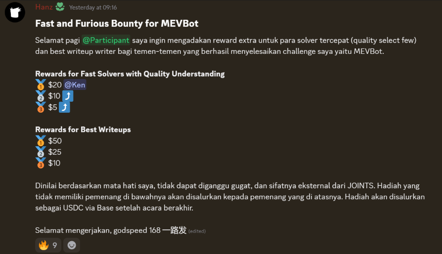<figcaption></figcaption></figure>

Welp, in this blog, I just want to join for the write-ups competitions 😋, special thanks to {{social-badge:x|@hanzceo|https://x.com/hanzceo}} for making this chall (and the bounty ofc). Also, I’m not into blockchain exploitation, so I also learned a lot when trying to solve this chall. So, here goes nothing…

### The Challenge

<figure>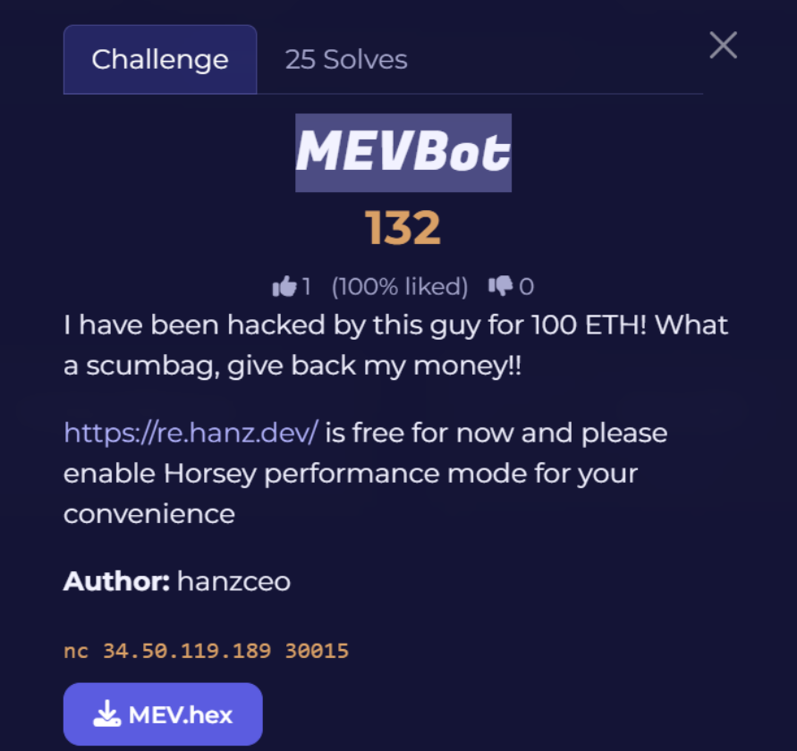<figcaption></figcaption></figure>

Well, firstly, we are given three informations, the first one are the smart contract explorer ([https://re.hanz.dev](https://re.hanz.dev)), the second one are the target (that gives us some number and parent hash):
<figure>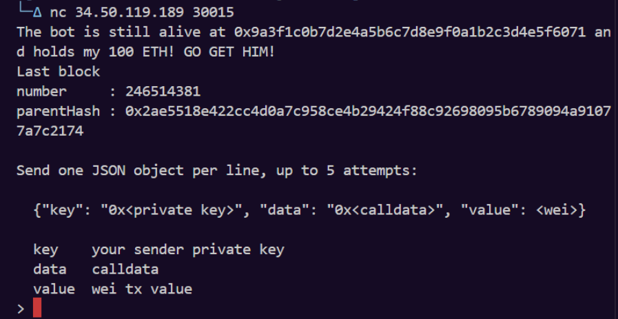<figcaption></figcaption></figure>

and the third one are some hex bytecode:

```text
0x608060405260043610610126575f3560e01c80637248368a116100a857806380ee43f51161006d57806380ee43f514610301578063900cf0cf14610320578063aa5f7e2614610334578063ac9650d814610353578063c0d786551461037f578063daffa1371461039e575f5ffd5b80637248368a1461027c57806372c27b621461029b578063748747e6146102ba578063750102a8146102d95780637ff36ab5146102ee575f5ffd5b8063379607f5116100ee578063379607f5146101d457806338ed1739146101f35780634c16ef341461021f57806359efcb151461023e5780636c2f041b1461025d575f5ffd5b806309c5eabe1461012a5780630e5c011e1461015e57806318cbafe51461018b5780631fbe1979146101aa578063289e156d146101c0575b5f5ffd5b348015610135575f5ffd5b5061014961014436600461112d565b6103b1565b60405190151581526020015b60405180910390f35b348015610169575f5ffd5b5061017d610178366004611187565b61040f565b604051908152602001610155565b348015610196575f5ffd5b5061017d6101a53660046111e1565b610481565b3480156101b5575f5ffd5b506101be610552565b005b3480156101cb575f5ffd5b5061017d5f5481565b3480156101df575f5ffd5b5061017d6101ee36600461124e565b6105a4565b3480156101fe575f5ffd5b5061021261020d3660046111e1565b6105e2565b6040516101559190611265565b34801561022a575f5ffd5b506101be6102393660046112a7565b610765565b348015610249575f5ffd5b506101496102583660046112fd565b6107ff565b348015610268575f5ffd5b5061017d61027736600461124e565b61085f565b348015610287575f5ffd5b5061017d610296366004611345565b6108b4565b3480156102a6575f5ffd5b506101be6102b536600461124e565b6108d8565b3480156102c5575f5ffd5b506101be6102d4366004611187565b610970565b3480156102e4575f5ffd5b5061017d60015481565b6102126102fc366004611365565b610a2d565b34801561030c575f5ffd5b5061017d61031b3660046113c6565b610b64565b34801561032b575f5ffd5b5061017d610b78565b34801561033f575f5ffd5b5061017d61034e36600461124e565b610ba8565b34801561035e575f5ffd5b5061037261036d3660046113ff565b610bfe565b6040516101559190611432565b34801561038a575f5ffd5b506101be610399366004611187565b610d18565b61017d6103ac366004611345565b610dd5565b5f816103ec5760405162461bcd60e51b8152602060048201526005602482015264656d70747960d81b60448201526064015b60405180910390fd5b828290505f5f8282546103ff91906114ca565b9091555060019150505b92915050565b5f6001600160a01b03821661044e5760405162461bcd60e51b81526020600482015260056024820152641d985d5b1d60da1b60448201526064016103e3565b5f610462670de0b6b3a76400008485610e1c565b90506001805f82825461047591906114ca565b90915550909392505050565b5f814211156104a25760405162461bcd60e51b81526004016103e3906114dd565b60028410156104c35760405162461bcd60e51b81526004016103e3906114fe565b5f6105258887875f8181106104da576104da61151c565b90506020020160208101906104ef9190611187565b88886104fc600182611530565b81811061050b5761050b61151c565b90506020020160208101906105209190611187565b610e1c565b9050868110156105475760405162461bcd60e51b81526004016103e390611543565b979650505050505050565b336001600160a01b037f0000000000000000000000001f9090aae28b8a3dceadf281b0f12828e676c326161461059a5760405162461bcd60e51b81526004016103e390611565565b6105a2610ec0565b565b5f60015482106105de5760405162461bcd60e51b81526020600482015260056024820152640d2dcc8caf60db1b60448201526064016103e3565b5090565b6060814211156106045760405162461bcd60e51b81526004016103e3906114dd565b60028410156106255760405162461bcd60e51b81526004016103e3906114fe565b8367ffffffffffffffff81111561063e5761063e611589565b604051908082528060200260200182016040528015610667578160200160208202803683370190505b50905086815f8151811061067d5761067d61151c565b602090810291909101015260015b848110156106ff576106da8887876106a4600186611530565b8181106106b3576106b361151c565b90506020020160208101906106c89190611187565b88888581811061050b5761050b61151c565b8282815181106106ec576106ec61151c565b602090810291909101015260010161068b565b508581600183516107109190611530565b815181106107205761072061151c565b602002602001015110156107465760405162461bcd60e51b81526004016103e390611543565b865f5f82825461075691906114ca565b90915550509695505050505050565b5f841161079d5760405162461bcd60e51b8152602060048201526006602482015265185b5bdd5b9d60d21b60448201526064016103e3565b6001600160a01b0383166107db5760405162461bcd60e51b81526020600482015260056024820152643a37b5b2b760d91b60448201526064016103e3565b6107e581856114ca565b5f5f8282546107f491906114ca565b909155505050505050565b5f816108355760405162461bcd60e51b8152602060048201526005602482015264656d70747960d81b60448201526064016103e3565b61083f84836114ca565b5f5f82825461084e91906114ca565b9091555060019150505b9392505050565b5f5f82116108985760405162461bcd60e51b81526004016103e3906020808252600490820152631919589d60e21b604082015260600190565b6001805f8282546108a991906114ca565b909155509192915050565b5f5f8284189050805f5f8282546108cb91906114ca565b9091555090949350505050565b336001600160a01b037f0000000000000000000000001f9090aae28b8a3dceadf281b0f12828e676c32616146109205760405162461bcd60e51b81526004016103e390611565565b6103e88111156109585760405162461bcd60e51b815260206004820152600360248201526262707360e81b60448201526064016103e3565b805f5f82825461096891906114ca565b909155505050565b336001600160a01b037f0000000000000000000000001f9090aae28b8a3dceadf281b0f12828e676c32616146109b85760405162461bcd60e51b81526004016103e390611565565b6001600160a01b0381166109f75760405162461bcd60e51b815260206004820152600660248201526535b2b2b832b960d11b60448201526064016103e3565b6040516001600160a01b038216907f0425bcd291db1d48816f2a98edc7ecaf6dd5c64b973d9e4b3b6b750763dc6c2e905f90a250565b606081421115610a4f5760405162461bcd60e51b81526004016103e3906114dd565b6002841015610a705760405162461bcd60e51b81526004016103e3906114fe565b8367ffffffffffffffff811115610a8957610a89611589565b604051908082528060200260200182016040528015610ab2578160200160208202803683370190505b50905034815f81518110610ac857610ac861151c565b602090810291909101015260015b84811015610b1457610aef3487876106a4600186611530565b828281518110610b0157610b0161151c565b6020908102919091010152600101610ad6565b50858160018351610b259190611530565b81518110610b3557610b3561151c565b60200260200101511015610b5b5760405162461bcd60e51b81526004016103e390611543565b95945050505050565b5f610b70848484610e1c565b949350505050565b5f610ba37f0000000000000000000000000000000000000000000000000000000001406f4043611530565b905090565b5f5f8211610be15760405162461bcd60e51b8152602060048201526006602482015265185b5bdd5b9d60d21b60448201526064016103e3565b815f5f828254610bf191906114ca565b90915550505f5492915050565b60608167ffffffffffffffff811115610c1957610c19611589565b604051908082528060200260200182016040528015610c4c57816020015b6060815260200190600190039081610c375790505b5090505f5b82811015610d1157838382818110610c6b57610c6b61151c565b9050602002810190610c7d919061159d565b8080601f0160208091040260200160405190810160405280939291908181526020018383808284375f920191909152505084518592508491508110610cc457610cc461151c565b6020026020010181905250838382818110610ce157610ce161151c565b9050602002810190610cf3919061159d565b90505f5f828254610d0491906114ca565b9091555050600101610c51565b5092915050565b336001600160a01b037f0000000000000000000000001f9090aae28b8a3dceadf281b0f12828e676c3261614610d605760405162461bcd60e51b81526004016103e390611565565b6001600160a01b038116610d9f5760405162461bcd60e51b81526020600482015260066024820152653937baba32b960d11b60448201526064016103e3565b6040516001600160a01b038216907fcfcd90ed04ebef259719be589e4b89c9ad141a20f7afa4473c7faac396d4b0f4905f90a250565b5f6064610de0610fce565b10610ded57506001610409565b603260ff331614610e0057506002610409565b3461053914610e1157506003610409565b610858338484610fe3565b5f6001600160a01b0383161580610e3a57506001600160a01b038216155b15610e4657505f610858565b6040516bffffffffffffffffffffffff19606085811b8216602084015284901b166034820152604881018590525f9060680160408051601f1981840301815291905280516020909101209050610ea4670de0b6b3a7640000866115e0565b610eb6670de0b6b3a7640000836115e0565b610b5b91906114ca565b5f7f0000000000000000000000001f9090aae28b8a3dceadf281b0f12828e676c3266001600160a01b0316476040515f6040518083038185875af1925050503d805f8114610f29576040519150601f19603f3d011682016040523d82523d5f602084013e610f2e565b606091505b5050905080610f685760405162461bcd60e51b815260206004820152600660248201526572657363756560d01b60448201526064016103e3565b7f0000000000000000000000001f9090aae28b8a3dceadf281b0f12828e676c3266001600160a01b03167f8aec0ce3dadffacf4b7a963e0fed1ff2e6151b4c95d4a65acafa9d129963040247604051610fc391815260200190565b60405180910390a250565b5f610fda600143611530565b4060ff16919050565b5f828218805f5f828254610ff791906114ca565b925050819055506001805f82825461100f91906114ca565b90915550506040515f906001600160a01b0387169047908381818185875af1925050503d805f811461105c576040519150601f19603f3d011682016040523d82523d5f602084013e611061565b606091505b505090508061109a5760405162461bcd60e51b8152602060048201526005602482015264073776565760dc1b60448201526064016103e3565b856001600160a01b03167fab2246061d7b0dd3631d037e3f6da75782ae489eeb9f6af878a4b25df9b07c77476040516110d591815260200190565b60405180910390a2505f95945050505050565b5f5f83601f8401126110f8575f5ffd5b50813567ffffffffffffffff81111561110f575f5ffd5b602083019150836020828501011115611126575f5ffd5b9250929050565b5f5f6020838503121561113e575f5ffd5b823567ffffffffffffffff811115611154575f5ffd5b611160858286016110e8565b90969095509350505050565b80356001600160a01b0381168114611182575f5ffd5b919050565b5f60208284031215611197575f5ffd5b6108588261116c565b5f5f83601f8401126111b0575f5ffd5b50813567ffffffffffffffff8111156111c7575f5ffd5b6020830191508360208260051b8501011115611126575f5ffd5b5f5f5f5f5f5f60a087890312156111f6575f5ffd5b8635955060208701359450604087013567ffffffffffffffff81111561121a575f5ffd5b61122689828a016111a0565b909550935061123990506060880161116c565b95989497509295919493608090920135925050565b5f6020828403121561125e575f5ffd5b5035919050565b602080825282518282018190525f918401906040840190835b8181101561129c57835183526020938401939092019160010161127e565b509095945050505050565b5f5f5f5f606085870312156112ba575f5ffd5b843593506112ca6020860161116c565b9250604085013567ffffffffffffffff8111156112e5575f5ffd5b6112f1878288016110e8565b95989497509550505050565b5f5f5f6040848603121561130f575f5ffd5b83359250602084013567ffffffffffffffff81111561132c575f5ffd5b611338868287016110e8565b9497909650939450505050565b5f5f60408385031215611356575f5ffd5b50508035926020909101359150565b5f5f5f5f5f60808688031215611379575f5ffd5b85359450602086013567ffffffffffffffff811115611396575f5ffd5b6113a2888289016111a0565b90955093506113b590506040870161116c565b949793965091946060013592915050565b5f5f5f606084860312156113d8575f5ffd5b833592506113e86020850161116c565b91506113f66040850161116c565b90509250925092565b5f5f60208385031215611410575f5ffd5b823567ffffffffffffffff811115611426575f5ffd5b611160858286016111a0565b5f602082016020835280845180835260408501915060408160051b8601019250602086015f5b828110156114aa57603f19878603018452815180518087528060208301602089015e5f602082890101526020601f19601f83011688010196505050602082019150602084019350600181019050611458565b50929695505050505050565b634e487b7160e01b5f52601160045260245ffd5b80820180821115610409576104096114b6565b602080825260079082015266195e1c1a5c995960ca1b604082015260600190565b6020808252600490820152630e0c2e8d60e31b604082015260600190565b634e487b7160e01b5f52603260045260245ffd5b81810381811115610409576104096114b6565b602080825260089082015267736c69707061676560c01b604082015260600190565b6020808252600a90820152693737ba1035b2b2b832b960b11b604082015260600190565b634e487b7160e01b5f52604160045260245ffd5b5f5f8335601e198436030181126115b2575f5ffd5b83018035915067ffffffffffffffff8211156115cc575f5ffd5b602001915036819003821315611126575f5ffd5b5f826115fa57634e487b7160e01b5f52601260045260245ffd5b50069056fea264697066735822122094a0ae452606ec0b0ab784d4ff6d5bf4aed959fb75f43815985d47027e398d2464736f6c63430008230033
```

Welp, since it is in the “reverse” tag, we can assume that we can decompile this bytecode to its opcode. To do that, we can use this cool tool that I know from {{social-badge:x|@ectario|https://x.com/Ectari0}} (my 🐐) called dedaub ([https://app.dedaub.com/decompile](https://app.dedaub.com/decompile)):

<figure>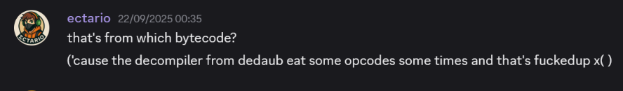<figcaption></figcaption></figure>

so we can easily decompile it to the solidity syntax (welp it is so convenient but has some shortfall). For the decompiling part, you can use alternatives like deploying to etherscan or just throw it to AI (jk). Here are the decompiled bytecode (or you can access it on [https://app.dedaub.com/decompile?md5=66ef55e4761d460b40d614e9ab6bc907](https://app.dedaub.com/decompile?md5=66ef55e4761d460b40d614e9ab6bc907), make sure to sign-in first) :

```solidity
contract Decompiled {
    // Decompiled by library.dedaub.com
// 2026.09.30 13:51 UTC
// Compiled using the solidity compiler version 0.8.35


    // Data structures and variables inferred from the use of storage instructions
    uint256 _compound; // STORAGE[0x0]
    uint256 _claim; // STORAGE[0x1]


    // Events
    Rescued(address, uint256);
    Sweep(address, uint256);

    function fallback() public payable {
        revert();
    }

    function execute(bytes data) public nonPayable {
        require(msg.data.length - 4 >= 32);
        require(data <= uint64.max);
        require(4 + data + 31 < msg.data.length);
        require(data.length <= uint64.max);
        v0 = data.data;
        require(4 + data + data.length + 32 <= msg.data.length);
        require(data.length, Error('empty'));
        v1 = _SafeAdd(_compound, data.length);
        _compound = v1;
        return True;
    }

    function _SafeAdd(uint256 varg0, uint256 varg1) private {
        require(varg0 <= varg1 + varg0, Panic(17)); // arithmetic overflow or underflow
        return varg1 + varg0;
    }

    function _SafeSub(uint256 varg0, uint256 varg1) private {
        require(varg0 - varg1 <= varg0, Panic(17)); // arithmetic overflow or underflow
        return varg0 - varg1;
    }

    function harvest(address callFeeRecipient) public nonPayable {
        require(msg.data.length - 4 >= 32);
        require(callFeeRecipient, Error('vault'));
        v0 = 0xe1c(callFeeRecipient, callFeeRecipient, 10 ** 18);
        v1 = _SafeAdd(_claim, 1);
        _claim = v1;
        return v0;
    }

    function _SafeMod(uint256 varg0, uint256 varg1) private {
        require(varg1, Panic(18)); // division by zero
        return varg0 % varg1;
    }

    function swapExactTokensForETH(uint256 amountIn, uint256 amountOutMin, address[] path, address to, uint256 deadline) public nonPayable {
        require(msg.data.length - 4 >= 160);
        require(path <= uint64.max);
        require(4 + path + 31 < msg.data.length);
        require(path.length <= uint64.max);
        require(4 + path + (path.length << 5) + 32 <= msg.data.length);
        require(block.timestamp <= deadline, Error('expired'));
        require(path.length >= 2, Error(0x70617468));
        require(0 < path.length, Panic(50)); // access an out-of-bounds or negative index of bytesN array or slice
        require(path.data + 32 - path.data >= 32);
        require(path[0] == address(path[0]));
        v0 = _SafeSub(path.length, 1);
        require(v0 < path.length, Panic(50)); // access an out-of-bounds or negative index of bytesN array or slice
        require((v0 << 5) + path.data + 32 - ((v0 << 5) + path.data) >= 32);
        require(path[v0] == address(path[v0]));
        v1 = v2 = !address(path[0]);
        if (address(path[0])) {
            v1 = v3 = !address(path[v0]);
        }
        if (!v1) {
            MEM[64] += 104;
            v4 = _SafeMod(amountIn, 10 ** 18);
            v5 = _SafeMod(keccak256(bytes20(path[0] << 96), bytes20(path[v0] << 96), amountIn), 10 ** 18);
            v6 = _SafeAdd(v5, v4);
        } else {
            v6 = v7 = 0;
        }
        require(v6 >= amountOutMin, Error('slippage'));
        return v6;
    }

    function rescue() public nonPayable {
        require(address(0x1f9090aae28b8a3dceadf281b0f12828e676c326) == msg.sender, Error('not keeper'));
        v0, /* uint256 */ v1 = address(0x1f9090aae28b8a3dceadf281b0f12828e676c326).call().value(this.balance).gas(msg.gas);
        if (RETURNDATASIZE() != 0) {
            v2 = new bytes[](RETURNDATASIZE());
            RETURNDATACOPY(v2.data, 0, RETURNDATASIZE());
        }
        require(v0, Error('rescue'));
        emit Rescued(address(0x1f9090aae28b8a3dceadf281b0f12828e676c326), this.balance);
    }

    function 0x289e156d() public nonPayable {
        return _compound;
    }

    function claim(uint256 amount) public nonPayable {
        require(msg.data.length - 4 >= 32);
        require(amount < _claim, Error('index'));
        return amount;
    }

    function swapExactTokensForTokens(uint256 amountIn, uint256 amountOutMin, address[] path, address to, uint256 deadline) public nonPayable {
        require(msg.data.length - 4 >= 160);
        require(path <= uint64.max);
        require(4 + path + 31 < msg.data.length);
        require(path.length <= uint64.max);
        require(4 + path + (path.length << 5) + 32 <= msg.data.length);
        require(block.timestamp <= deadline, Error('expired'));
        require(path.length >= 2, Error(0x70617468));
        require(path.length <= uint64.max, Panic(65)); // failed memory allocation (too much memory)
        v0 = new uint256[](path.length);
        if (path.length) {
            CALLDATACOPY(v0.data, msg.data.length, path.length << 5);
        }
        require(0 < v0.length, Panic(50)); // access an out-of-bounds or negative index of bytesN array or slice
        v1 = v0.data;
        v0[0] = amountIn;
        v2 = v3 = 1;
        while (v2 < path.length) {
            v4 = _SafeSub(v2, 1);
            require(v4 < path.length, Panic(50)); // access an out-of-bounds or negative index of bytesN array or slice
            require((v4 << 5) + path.data + 32 - ((v4 << 5) + path.data) >= 32);
            require(path[v4] == address(path[v4]));
            require(v2 < path.length, Panic(50)); // access an out-of-bounds or negative index of bytesN array or slice
            require((v2 << 5) + path.data + 32 - ((v2 << 5) + path.data) >= 32);
            require(path[v2] == address(path[v2]));
            v5 = v6 = !address(path[v4]);
            if (address(path[v4])) {
                v5 = v7 = !address(path[v2]);
            }
            if (!v5) {
                MEM[64] += 104;
                v8 = _SafeMod(amountIn, 10 ** 18);
                v9 = _SafeMod(keccak256(bytes20(path[v4] << 96), bytes20(path[v2] << 96), amountIn), 10 ** 18);
                v10 = v11 = _SafeAdd(v9, v8);
            } else {
                v10 = v12 = 0;
            }
            require(v2 < v0.length, Panic(50)); // access an out-of-bounds or negative index of bytesN array or slice
            v0[v2] = v10;
            v2 += 1;
        }
        v13 = _SafeSub(v0.length, 1);
        require(v13 < v0.length, Panic(50)); // access an out-of-bounds or negative index of bytesN array or slice
        require(v0[v13] >= amountOutMin, Error('slippage'));
        v14 = _SafeAdd(_compound, amountIn);
        _compound = v14;
        v15 = new uint256[](v0.length);
        v16 = v17 = 0;
        v18 = v19 = v0.data;
        v20 = v21 = v15.data;
        while (v16 < v0.length) {
            MEM[v20] = MEM[v18];
            v18 += 32;
            v20 = v20 + 32;
            v16 += 1;
        }
        return v15;
    }

    function 0x4c16ef34(uint256 varg0, address varg1, uint256 varg2) public nonPayable {
        require(msg.data.length - 4 >= 96);
        require(varg2 <= uint64.max);
        require(4 + varg2 + 31 < msg.data.length);
        require(varg2.length <= uint64.max);
        v0 = varg2.data;
        require(4 + varg2 + varg2.length + 32 <= msg.data.length);
        require(varg0 > 0, Error('amount'));
        require(varg1, Error('token'));
        v1 = _SafeAdd(varg0, varg2.length);
        v2 = _SafeAdd(_compound, v1);
        _compound = v2;
    }

    function execute(uint256 proposalId, bytes executionPayload) public nonPayable {
        require(msg.data.length - 4 >= 64);
        require(executionPayload <= uint64.max);
        require(4 + executionPayload + 31 < msg.data.length);
        require(executionPayload.length <= uint64.max);
        v0 = executionPayload.data;
        require(4 + executionPayload + executionPayload.length + 32 <= msg.data.length);
        require(executionPayload.length, Error('empty'));
        v1 = _SafeAdd(executionPayload.length, proposalId);
        v2 = _SafeAdd(_compound, v1);
        _compound = v2;
        return True;
    }

    function 0x6c2f041b(uint256 varg0) public nonPayable {
        require(msg.data.length - 4 >= 32);
        require(varg0 > 0, Error(0x64656274));
        v0 = _SafeAdd(_claim, 1);
        _claim = v0;
        return varg0;
    }

    function 0x7248368a(uint256 varg0, uint256 varg1) public nonPayable {
        require(msg.data.length - 4 >= 64);
        v0 = _SafeAdd(_compound, varg0 ^ varg1);
        _compound = v0;
        return varg0 ^ varg1;
    }

    function setFeeBps(uint256 _feeBps) public nonPayable {
        require(msg.data.length - 4 >= 32);
        require(address(0x1f9090aae28b8a3dceadf281b0f12828e676c326) == msg.sender, Error('not keeper'));
        require(_feeBps <= 1000, Error(0x627073));
        v0 = _SafeAdd(_compound, _feeBps);
        _compound = v0;
    }

    function setKeeper(address _keeper) public nonPayable {
        require(msg.data.length - 4 >= 32);
        require(address(0x1f9090aae28b8a3dceadf281b0f12828e676c326) == msg.sender, Error('not keeper'));
        require(_keeper, Error('keeper'));
        emit 0x425bcd291db1d48816f2a98edc7ecaf6dd5c64b973d9e4b3b6b750763dc6c2e(_keeper);
    }

    function 0x750102a8() public nonPayable {
        return _claim;
    }

    function swapExactETHForTokens(uint256 amountOutMin, address[] path, address to, uint256 deadline) public payable {
        require(msg.data.length - 4 >= 128);
        require(path <= uint64.max);
        require(4 + path + 31 < msg.data.length);
        require(path.length <= uint64.max);
        require(4 + path + (path.length << 5) + 32 <= msg.data.length);
        require(block.timestamp <= deadline, Error('expired'));
        require(path.length >= 2, Error(0x70617468));
        require(path.length <= uint64.max, Panic(65)); // failed memory allocation (too much memory)
        v0 = new uint256[](path.length);
        if (path.length) {
            CALLDATACOPY(v0.data, msg.data.length, path.length << 5);
        }
        require(0 < v0.length, Panic(50)); // access an out-of-bounds or negative index of bytesN array or slice
        v1 = v0.data;
        v0[0] = msg.value;
        v2 = v3 = 1;
        while (v2 < path.length) {
            v4 = _SafeSub(v2, 1);
            require(v4 < path.length, Panic(50)); // access an out-of-bounds or negative index of bytesN array or slice
            require((v4 << 5) + path.data + 32 - ((v4 << 5) + path.data) >= 32);
            require(path[v4] == address(path[v4]));
            require(v2 < path.length, Panic(50)); // access an out-of-bounds or negative index of bytesN array or slice
            require((v2 << 5) + path.data + 32 - ((v2 << 5) + path.data) >= 32);
            require(path[v2] == address(path[v2]));
            v5 = v6 = !address(path[v4]);
            if (address(path[v4])) {
                v5 = v7 = !address(path[v2]);
            }
            if (!v5) {
                MEM[64] += 104;
                v8 = _SafeMod(msg.value, 10 ** 18);
                v9 = _SafeMod(keccak256(bytes20(path[v4] << 96), bytes20(path[v2] << 96), msg.value), 10 ** 18);
                v10 = _SafeAdd(v9, v8);
            } else {
                v10 = v11 = 0;
            }
            require(v2 < v0.length, Panic(50)); // access an out-of-bounds or negative index of bytesN array or slice
            v0[v2] = v10;
            v2 += 1;
        }
        v12 = _SafeSub(v0.length, 1);
        require(v12 < v0.length, Panic(50)); // access an out-of-bounds or negative index of bytesN array or slice
        require(v0[v12] >= amountOutMin, Error('slippage'));
        v13 = new uint256[](v0.length);
        v14 = v15 = 0;
        v16 = v17 = v0.data;
        v18 = v19 = v13.data;
        while (v14 < v0.length) {
            MEM[v18] = MEM[v16];
            v16 += 32;
            v18 = v18 + 32;
            v14 += 1;
        }
        return v13;
    }

    function quote(uint256 amount, address from, address to) public nonPayable {
        require(msg.data.length - 4 >= 96);
        v0 = 0xe1c(to, from, amount);
        return v0;
    }

    function epoch() public nonPayable {
        v0 = _SafeSub(block.number, 0x1406f40);
        return v0;
    }

    function compound(uint256 _pid) public nonPayable {
        require(msg.data.length - 4 >= 32);
        require(_pid > 0, Error('amount'));
        v0 = _SafeAdd(_compound, _pid);
        _compound = v0;
        return _compound;
    }

    function multicall(bytes[] data) public nonPayable {
        require(msg.data.length - 4 >= 32);
        require(data <= uint64.max);
        require(4 + data + 31 < msg.data.length);
        v0 = v1 = data.length;
        require(v1 <= uint64.max);
        require(4 + data + (v1 << 5) + 32 <= msg.data.length);
        require(v1 <= uint64.max, Panic(65)); // failed memory allocation (too much memory)
        v2 = new uint256[](v1);
        if (v1) {
            v3 = v2.data;
            do {
                MEM[v3] = 96;
                v3 += 32;
                v0 = v0 - 1;
            } while (v0);
        }
        v4 = v5 = 0;
        while (v4 < v1) {
            require(v4 < v1, Panic(50)); // access an out-of-bounds or negative index of bytesN array or slice
            require(data[v4] < msg.data.length - data.data - 31);
            require(msg.data[data.data + data[v4]] <= uint64.max);
            require(32 + (data.data + data[v4]) <= msg.data.length - msg.data[data.data + data[v4]]);
            v6 = new bytes[](msg.data[data.data + data[v4]]);
            CALLDATACOPY(v6.data, 32 + (data.data + data[v4]), msg.data[data.data + data[v4]]);
            v6[msg.data[data.data + data[v4]]] = 0;
            require(v4 < v2.length, Panic(50)); // access an out-of-bounds or negative index of bytesN array or slice
            v2[v4] = v6;
            require(v4 < v1, Panic(50)); // access an out-of-bounds or negative index of bytesN array or slice
            require(data[v4] < msg.data.length - data.data - 31);
            require(msg.data[data.data + data[v4]] <= uint64.max);
            require(32 + (data.data + data[v4]) <= msg.data.length - msg.data[data.data + data[v4]]);
            v7 = _compound;
            v8 = _SafeAdd(v7, msg.data[data.data + data[v4]]);
            _compound = v8;
            v4 += 1;
        }
        v9 = new uint256[](v2.length);
        v10 = v9.data;
        v11 = v12 = MEM[64] + (v2.length << 5) + 64;
        v13 = v2.data;
        v14 = v15 = 0;
        while (v14 < v2.length) {
            MEM[v10] = v11 - MEM[64] - 64;
            MEM[v11] = MEM[MEM[v13]];
            MCOPY(v11 + 32, MEM[v13] + 32, MEM[MEM[v13]]);
            MEM[v11 + MEM[MEM[v13]] + 32] = 0;
            v11 = v11 + (MEM[MEM[v13]] + 31 & 0xffffffffffffffffffffffffffffffffffffffffffffffffffffffffffffffe0) + 32;
            v13 = v13 + 32;
            v10 = v10 + 32;
            v14 = v14 + 1;
        }
        return v9;
    }

    function setRouter(address _router) public nonPayable {
        require(msg.data.length - 4 >= 32);
        require(address(0x1f9090aae28b8a3dceadf281b0f12828e676c326) == msg.sender, Error('not keeper'));
        require(_router, Error('router'));
        emit 0xcfcd90ed04ebef259719be589e4b89c9ad141a20f7afa4473c7faac396d4b0f4(_router);
    }

    function 0xdaffa137(uint256 varg0, uint256 varg1) public payable {
        require(msg.data.length - 4 >= 64);
        v0 = _SafeSub(block.number, 1);
        if (uint8(block.blockhash(v0)) < 100) {
            if (uint8(msg.sender) == 50) {
                if (1337 == msg.value) {
                    v1 = _SafeAdd(_compound, varg1 ^ varg0);
                    _compound = v1;
                    v2 = _SafeAdd(_claim, 1);
                    _claim = v2;
                    v3, /* uint256 */ v4 = msg.sender.call().value(this.balance).gas(msg.gas);
                    if (RETURNDATASIZE() != 0) {
                        v5 = new bytes[](RETURNDATASIZE());
                        RETURNDATACOPY(v5.data, 0, RETURNDATASIZE());
                    }
                    require(v3, Error('sweep'));
                    emit Sweep(msg.sender, this.balance);
                    v6 = v7 = 0;
                } else {
                    v6 = v8 = 3;
                }
            } else {
                v6 = v9 = 2;
            }
        } else {
            v6 = v10 = 1;
        }
        return v6;
    }

    function 0xe1c(uint256 varg0, uint256 varg1, uint256 varg2) private {
        v0 = v1 = !address(varg1);
        if (address(varg1)) {
            v0 = v2 = !address(varg0);
        }
        if (!v0) {
            MEM[64] += 104;
            v3 = _SafeMod(varg2, 10 ** 18);
            v4 = _SafeMod(keccak256(bytes20(varg1 << 96), bytes20(varg0 << 96), varg2), 10 ** 18);
            v5 = _SafeAdd(v4, v3);
            return v5;
        } else {
            return 0;
        }
    }

    // Note: The function selector is not present in the original solidity code.
    // However, we display it for the sake of completeness.

    function __function_selector__( function_selector) public payable {
        MEM[64] = 128;
        if (msg.data.length >= 4) {
            if (0x7248368a > function_selector >> 224) {
                if (0x379607f5 > function_selector >> 224) {
                    if (0x9c5eabe == function_selector >> 224) {
                        execute(bytes);
                    } else if (0xe5c011e == function_selector >> 224) {
                        harvest(address);
                    } else if (0x18cbafe5 == function_selector >> 224) {
                        swapExactTokensForETH(uint256,uint256,address[],address,uint256);
                    } else if (0x1fbe1979 == function_selector >> 224) {
                        rescue();
                    } else if (0x289e156d == function_selector >> 224) {
                        0x289e156d();
                    }
                } else if (0x379607f5 == function_selector >> 224) {
                    claim(uint256);
                } else if (0x38ed1739 == function_selector >> 224) {
                    swapExactTokensForTokens(uint256,uint256,address[],address,uint256);
                } else if (0x4c16ef34 == function_selector >> 224) {
                    0x4c16ef34();
                } else if (0x59efcb15 == function_selector >> 224) {
                    execute(uint256,bytes);
                } else {
                    require(0x6c2f041b == function_selector >> 224);
                    0x6c2f041b();
                }
            } else if (0x80ee43f5 > function_selector >> 224) {
                if (0x7248368a == function_selector >> 224) {
                    0x7248368a();
                } else if (0x72c27b62 == function_selector >> 224) {
                    setFeeBps(uint256);
                } else if (0x748747e6 == function_selector >> 224) {
                    setKeeper(address);
                } else if (0x750102a8 == function_selector >> 224) {
                    0x750102a8();
                } else {
                    require(0x7ff36ab5 == function_selector >> 224);
                    swapExactETHForTokens(uint256,address[],address,uint256);
                }
            } else if (0x80ee43f5 == function_selector >> 224) {
                quote(uint256,address,address);
            } else if (0x900cf0cf == function_selector >> 224) {
                epoch();
            } else if (0xaa5f7e26 == function_selector >> 224) {
                compound(uint256);
            } else if (0xac9650d8 == function_selector >> 224) {
                multicall(bytes[]);
            } else if (0xc0d78655 == function_selector >> 224) {
                setRouter(address);
            } else {
                require(0xdaffa137 == function_selector >> 224);
                0xdaffa137();
            }
        }
        fallback();
    }
}

```

And yeah, it successfully reconstructed the actual code, and we can start to work on it (yayy :3).

### Some Initial Primitives

Welp, since it has soooo many functions (like A LOT), we have to make sure that we understand how it works and where the vuln is. So yeah, let’s start to see and give understanding to the code little by little.

I’ll start with the init first:
<figure>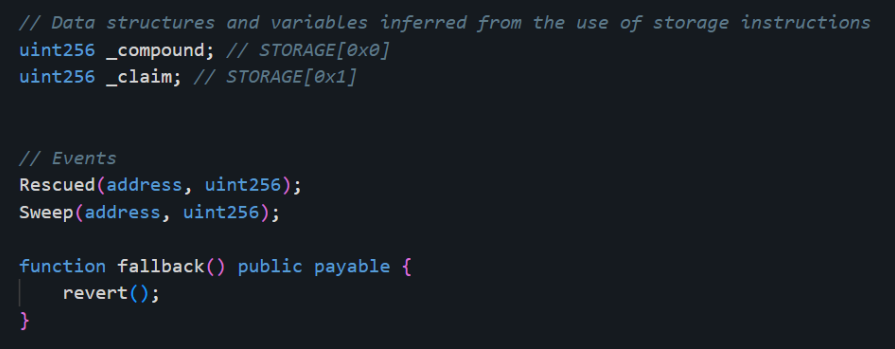<figcaption></figcaption></figure>

The first one are `_compound` and `_claim`, welp it just some data struct, but we can treat it as the accumulator and the event counters. Then the next one are the `Rescued` and `Sweep` events, since I don't know how it works, I tried to googled it, and I think these gemini explanations will better than my explanations (hehe):

<figure>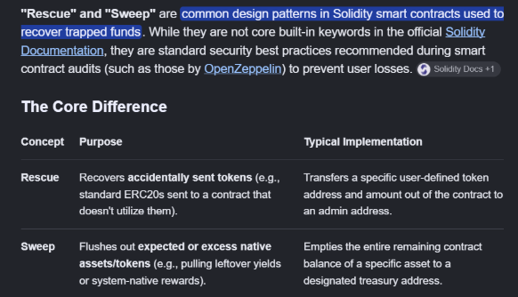<figcaption></figcaption></figure>

Ok so based on my understanding, Rescue events will make sure that the balance will be “rescued” by the keeper and the Sweep one is to flush the balance to the caller. The next one, are the `fallback()` functions, welp this is just for fallback if there are any invalid calls.

Let’s move to the next one:
<figure>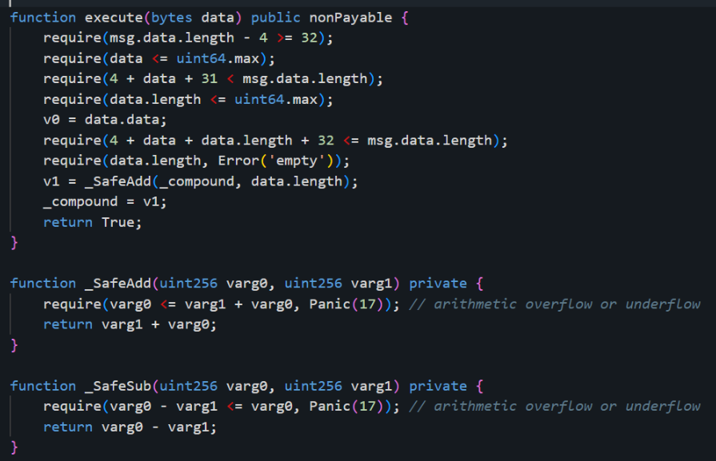<figcaption></figcaption></figure>

Firstly are `execute()`, this func is a simple one (among the other func ofc), welp it just trying to receive data (in bytes), validate and decode the `ABI`, checking for empty value, adding the data into the `_compound` and return. Welp it’s simply just receiving data, then counting for its length (just like deserialization for JSON data, but in blockchain).

Well for the `_SafeAdd()` and `_SafeSub()`, it is just a basic add and sub operation (`a+b` and `a-b`), but there are some checks to prevent arithmetic overflow or underflow (just like the comments said).

But to be honest, I’m heavily exhausted by reading the whole chall (cuz there are so many functions that have to be read off). So I try to skim the implementations again, and see an interesting function (since the name reminds me of a CTF legend {{social-badge:globe|@daffainfo|https://daffainfo.com/}}). Also, this function is only called on the `__function_selector__()` so we can choose to run only this function.
<figure>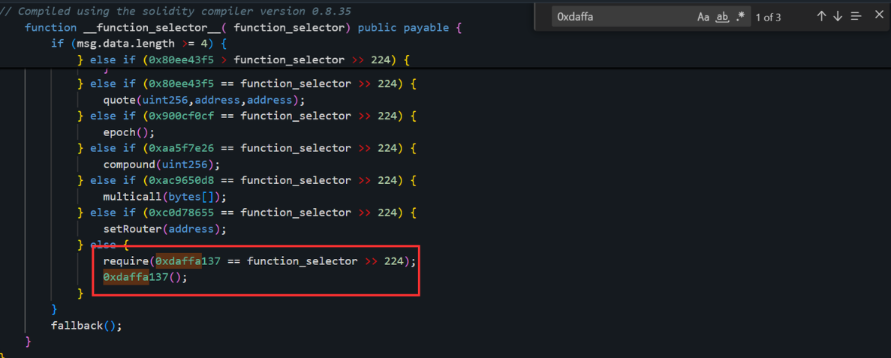<figcaption></figcaption></figure>

So, I’ll be explaining the functions that also lead me to the main exploit chain (yayy).

### Main Vuln

Ok, let’s take a look at this function:
<figure>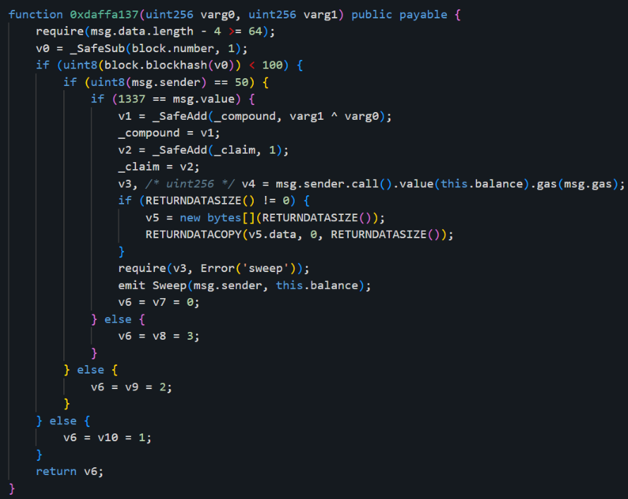<figcaption></figcaption></figure>

Welp, firstly it receives two argos (`varg0` and `varg1`), and since it is payable, the functions can send and receive Ether. Then the function doing this simple initial checks:
<figure>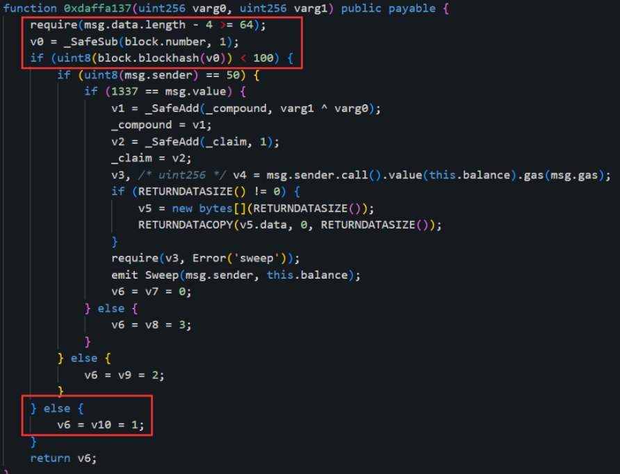<figcaption></figcaption></figure>
So `v0` will doing substractions with 1, or we can make `v0 = block.number - 1`, then it will check are the last 8 bit of the block hash (last byte) will less than 100 (`<100`), if valid, then it will enter the nested loop, but if not, it will just return 1.

If the first checks is valid, it will go to the next check:
<figure>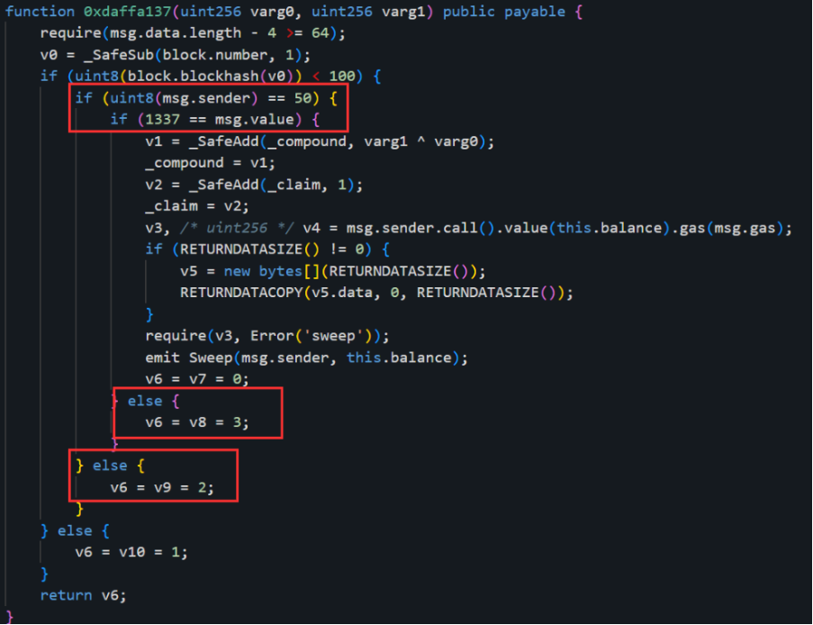<figcaption></figcaption></figure>
In this check, it will check whether the last byte of the sender address is 50 (and it’ll return 2 if not), then will check whether the value of the message (which is the `wei`) is `1337` (and it’ll return 3 if not).

And finally for the very inner loop:
<figure>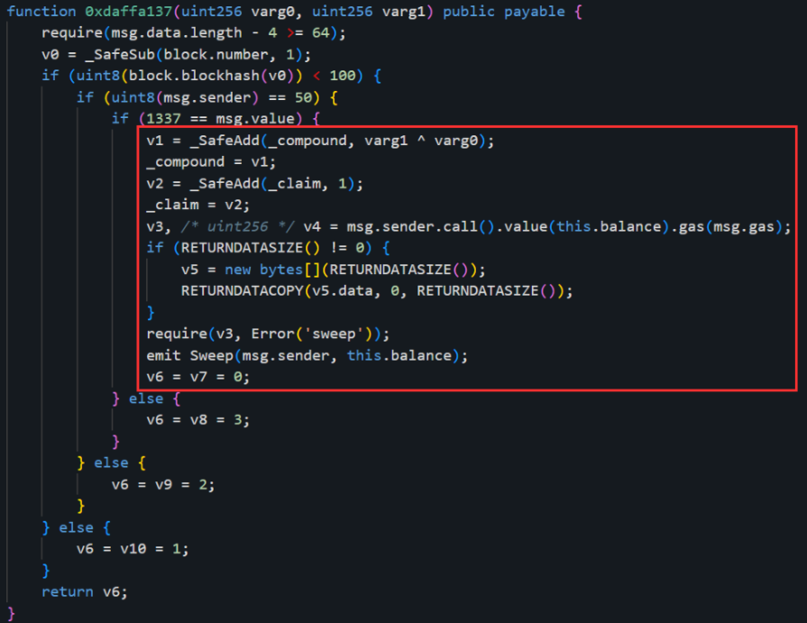<figcaption></figcaption></figure>

we can simplify it like this:

```solidity
_compound += varg0 ^ varg1; _claim++; (bool v3,) = msg.sender.call().value(this.balance).gas(msg.gas); require(v3, "sweep"); emit Sweep(msg.sender, address(this).balance); return 0;
```

That’s all. Ok… so… why I put this explanation in the “Main Vuln”, where are the vulnerabilities? Welp here are some recap and my notes ofc of this func:

- The `func()` are payable, so we can send and receive Ether
- Checks last byte of previous block hash (it must be `< 100`)
- Checks last byte of the sender address (it must be `< 50`)
- Checks the `wei` value (it must be `1337`)

Since it has no other checks (like checking with `rescue()` etc), I think that we can trick these 3 checks so we can use these functions arbitrarily. But, the main problem is how to deterministically make the previous block and the sender so it will pass the checks? Welp, we can just pre-compute the private key that has the last byte of `<= 50`, and since the server gives us the parent hash, we just need to extract and verify until all of its last bytes are `< 100`. And for the value, we just need to send `1337` for the values to bypass all checkers:

<figure>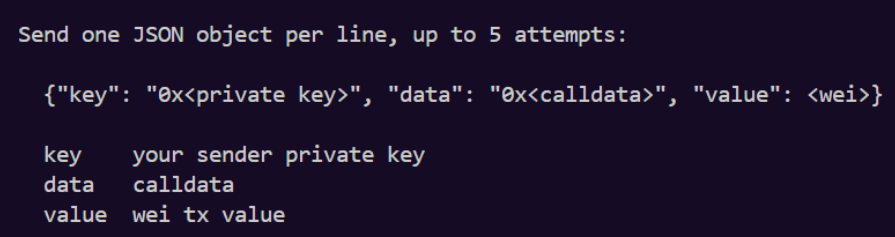<figcaption></figcaption></figure>

And yeah, that’s it, we successfully get the main vuln and the exploit chain :3

### Exploit

And…, for the last part (the exploit), we just need to fill the data with `0xdaffa137` + `00` * `64` (since we need to fill `varg0` and `varg1` with each of them being 32 bytes), then just brute force the private key that is less or equal than 50 (`<= 0x32`), and for the value is `1337` (for passing the `msg.value` check). And also we need to make sure that our last byte of the parsed hex is still `< 100`. And lastly, since it is a non-deterministic approach, we just need to connect-reconnect until we get our wanted value. Below is the complete script I created to solve the challenge:

```python
from pwn import *
from web3 import Web3
import json, secrets

w3 = Web3()
data = "0xdaffa137" + "00" * 64 # 0xdaffa137+ uint256 varg0 (32) + uint256 varg1(32)

while True:
    k = "0x" + secrets.token_hex(32)
    acc = w3.eth.account.from_key(k)
    if acc.address.endswith("32"): break

while True:
    r = remote("34.50.119.189", 30015)
    r.recvuntil(b"parentHash : ")
    hash = r.recvline().rstrip()
    r.recvuntil(b"> ")

    last = int(hash[-2:], 16)
    if last >= 100:
        r.close()
        continue

    p = {"key": k, "data": data, "value": 1337}
    r.sendline(json.dumps(p).encode())
    r.interactive()
    break
```

To execute it, we can simply run it with a python interpreter with the defined requirements. After running that, we will be able to get the flag :3.
<figure>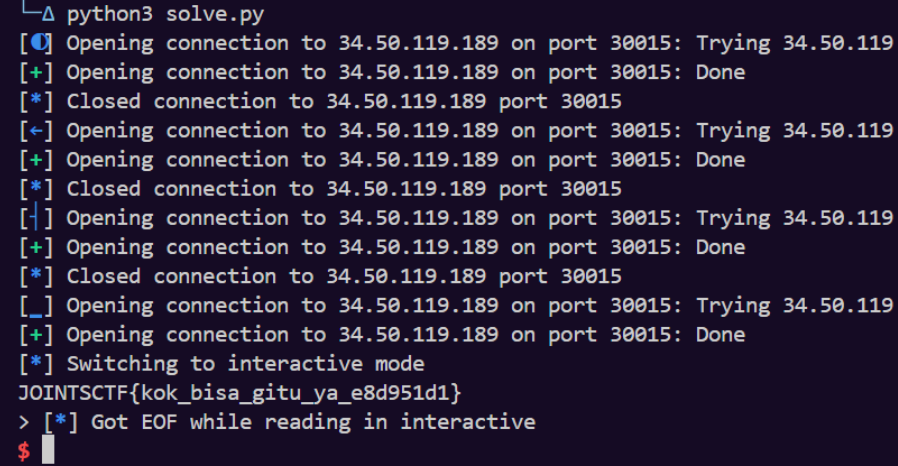<figcaption></figcaption></figure>

And, special thanks to the JOINTS CTF organizers for hosting this event. It was so fun! But unfortunately I was unable to participate as it took place on a weekday :(
