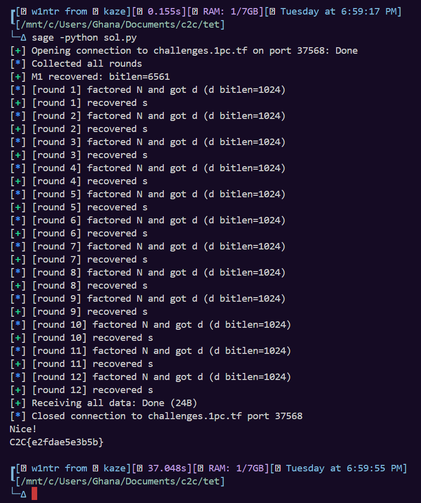

This article covers `tet` from **C2C CTF 2026**, a cryptography challenge by **azuketto** (my goat) that indeed are the harder version of {{github-badge:vibes|https://github.com/ctf-gemastik/penyisihan-2025-public/tree/main/cry/vibes}} from the GEMASTIK 2025 qualifiers for second division. I spent a couple of hours on it before the main idea became clear, but once that part clicked, the rest of the solve followed in a much more direct way.

What follows is the path I used to break the challenge down, starting from the given script and moving through the recovery of the hidden values one layer at a time.

### Initial Analysis

In this challenge, we are given some big RSA scheme, and the source code given in  `tet_tet-dist.zip`. Here are the screenshots of the content:

<figure><figcaption></figcaption></figure>

Welp, lemme just give the `chall.py` here:

```python
import sys, signal
from secrets import randbelow
from math import gcd
from Crypto.Util.number import getPrime, inverse
import random
from libnum import n2s

rbits = lambda x: random.getrandbits(x)

R=12;BITS=1024;M_BITS=81*81;TIME=200;DIF=1000
signal.signal(signal.SIGALRM,lambda *_:(print("timeout"),sys.exit(1)))
signal.alarm(TIME)
M1 = randbelow(1<<M_BITS) or 1
ss = []

def one_round(i):
    p,q=getPrime(BITS),getPrime(BITS)
    N=p*q
    a,b,c=rbits(DIF),rbits(DIF),rbits(DIF*6)
    g=gcd(a, b)
    a//=g
    b//=g
    phi=(p**3-a)*(q**3-b)
    d=getPrime(BITS)
    e=inverse(d,phi)
    f=e*M1+c
    s=randbelow(N-2)
    m2=M1*a+b
    z=pow(s,e*d,N)
    U2=pow(s+m2*N,d,N*N)
    print(f"=== Round {i}/{R} ===")
    print(f"N = {n2s(N).hex()}")
    print(f"a/b = {n2s((a * pow(b, -1, N)) % N).hex()}")
    print(f"f = {n2s(f).hex()}")
    print(f"z = {n2s(z).hex()}")
    print(f"g = {n2s(g).hex()}")
    print(f"U2 = {n2s(U2).hex()}")
    ss.append(s)

for i in range(1,R+1):one_round(i)
for i in range(1,R+1):
    g = int(input(f"Enter guess for round {i}/{R} >> "))
    if g == ss[i-1]: print("Nice!")
    else:
        print("Fail!")
        exit(1)
print(open("flag.txt").read().strip())

```

Well to sum things up, we have $N$, $a/b$, $f$, $z$, $g$, and $U_2$ for each round. The goal are to recovering $s$ so we can guess the $ss$.

***

### Recovering M1

So, the $M_1$ are defined in this line:

```python
M1 = randbelow(1<<M_BITS) or 1
```

With `M_BITS` are 6561, so the $M_1$ size are around that (6561 bits). Now the interesting part are, $M_1$ are static value, but it has this relations each round-$i$:

$$
f_i = e_i \cdot M_1 + c_i
$$

In that equations, we only have $f$ for each round., so for 12 rounds, we have $f$ that each of it almost a multiple of $M_1$. Usually to solve that problem, we can simply solve the Greatest Common Divisor (GCD) for that equations:

$$
\gcd(f_1, f_2, ...) = M_1 \cdot \gcd(e_1, e_2, ...)
$$

The problem are, there are 12 unknown $c$ values (noises) and each of it have a quite big size (6000 bits) but still smaller than $M_1$. But notice that noise ($c$) constrained in this conditions:

$$
|c_i| < 2^\rho, \rho \approx 6{,}000
$$

With that condition, we still can recover $M_1$ using lattice. So, we can use Approximate Common Divisor (ACD) approach.

But how to do ACD? First, we need to set our target, and the target are to search for modulus that makes all remainder small. Suppose we have this equations:

$$
f_i \bmod M_1 = c_i
$$

If we have the correct $M_1$, all of the remainder will remains small, so to check if our $M_1$ correct are not, simply do this check:

$$
f_i \bmod M_1 < 2^\rho
$$

Now, step up to the lattice part. First, we need to search for small integer relations that make $f_i$'s linear combination to be almost a multiple of $M_1$ . So, we need to take a sample for the anchor, for example:

$$
x_0 = f_0
$$

and the other samples as:

$$
x_1, \ldots, x_{t-1}
$$

Wrote it as:

$$
x_j = e_j \cdot M_1 + c_j
$$

Suppose that we want to obtain a number $qq$ so that:

$$
x_0 \equiv r_0 \pmod{qq}
$$

and $r_0$ small.  If $qq = M_1$ (or one of its multiple), then $r_0 = c_0$ also small.

So to make the basis for the lattice, we need to consider these things:

* Choose bounded noise and number of samples;
* Make the basis so that

$$
B \in \mathbb{Z}^{t \times t}
$$

$$
B = \begin{pmatrix}
2^{\rho+1} & x_1 & x_2 & \cdots & x_{t-1} \\
0 & -x_0 & 0 & \cdots & 0 \\
0 & 0 & -x_0 & \cdots & 0 \\
\vdots & & & \ddots & \vdots \\
0 & 0 & 0 & \cdots & -x_0
\end{pmatrix}
$$

Next, from that basis, we can take a vector:

$$
v = (qq, k_1, k_2, \ldots, k_{t-1})
$$

From that vector, if we multiply the vector with the basis, we get lattice vector.

First component:

$$
v_0 = qq \cdot 2^{\rho+1} + \sum_{j=1}^{t-1} k_j x_j
$$

And for the other component:

$$
v_j = -k_j x_0 \quad \text{for } j \geq 1
$$

Basically in this point, we can do LLL algorithm to reduce the problem and search for shortest vector, and later on from the LLL result, we can approximate the qq as:

$$
qq \approx \left| \frac{L_{0,0}}{2^{\rho+1}} \right|
$$

Because it only some approximation, $qq$ can falls to either $M_1$ or $e$ or the multiple of it. So, to recover the $M_1$, just do:

$$
M_1 = \left| \frac{x_0 - r_0}{qq} \right|
$$

Yayyy, we get the $M_1$!

***

### Recovering e

We will still use this equation to recover the $e$:

$$
f = e \cdot M_1 + c
$$

suppose that we divide the whole equation by $M_1$, so the equation will be:

$$
\frac{f}{M_1} = \frac{e \cdot M_1 + c}{M_1} = e + \frac{c}{M_1}
$$

Now, notice that $M_1$ are much bigger than $e$, so:

$$
0 \leq \frac{c}{M_1} < 1
$$

Because of that conditions, we can just ignore the $c$ divided by $M_1$, and we can recover the e with this equations:

$$
e \approx \frac{f}{M_1} = \left\lfloor \frac{f}{M_1} \right\rfloor
$$

Hooray.

***

### Recovering (a, b)

Ok, so we have this value:

$$
x \equiv \frac{a}{b} \pmod{N}
$$

with $N$ approximately 2048 bits and the $a,b$ are small (approximately 1000 bits) we can recover both of them with rational construction (small fractions from $mod N$ residue). So here are the congruency of that:

$$
x \equiv a \cdot b^{-1} \pmod{N}
$$

$$
x \cdot b \equiv a \pmod{N}
$$

$$
a=x \cdot b - k \cdot N
$$

$$
a-x \cdot b = -k \cdot N
$$

So, we just have to search for small pair of $(a,b)$ that satisfy that congruences, and because:

$$
|a|, |b| < \frac{\sqrt{N}}{2}
$$

The solution will be unique.

***

### Recovering (k,d)

For this part, we will use the $\phi$ equation:

$$
\phi = (p^3-a)(q^3-b)
$$

and this equation:

$$
e=d^{-1} \pmod{\phi} ... (1)
$$

Means that, there are $k$ that makes:

$$
ed \equiv 1 \pmod \phi \iff ed - 1 = k\phi
$$

Then, let we expand the $\phi$ equations:

$$
\phi = (p^3-a)(q^3-b)=p^3q^3-bp^3-aq^3+ab
$$

$$
\phi = N^3-bp^3-aq^3+ab
$$

If you careful enough, $bp^3+aq^3$ are approximately 4072 bits, and this size are smaller than $N^3$. So, we can conclude that $\phi$ are approximately $N^3$ , and from $(1)$, this equations will hold:

$$
\frac{e}{\phi} = \frac{k}{d} + \frac{1}{d\phi}
$$

$$
\frac{e}{\N^3} \approx \frac{e}{\phi} \approx \frac{k}{d}
$$

With that conditions, we can recover $(k,d)$ by using continued fractions!

***

### Recovering Prime Factors

Now, we will start to sum things up and get the flag. First, we have to expand this $\phi$ equation:

$$
\phi = N^3-bp^3-aq^3+ab
$$

$$
bp^3+aq^3 = N^3+ab-\phi
$$

Then, suppose that we define $S$ as:

$$
S=N^3+ab-\phi ... (2)
$$

$$
S=bp^3+aq^3
$$

and we know that:

$$
q^3 = \left( \frac{N}{p} \right)^3 = \frac{N^3}{p^3}
$$

if we substitute $X = p^3$, then $q^3 = N^3/X$.

Next, we can change equation $(2)$ to this form:

$$
S=bX + a\frac{N^3}{X}
$$

$$
bX^2-SX+aN^3=0
$$

So we successfully simplify the complex equation to a quadratic problem. Then, we can calculate $X$ by doing root-discriminant equation:

$$
X = \frac{S \pm \sqrt{S^2 - 4abN^3}}{2b}
$$

then, we can get the $p$ by searching for third root of $X$, then we also can get the $q$ by dividing $N$ with $p$.

***

### Recovering s :3

Remember that we have the $U_2$ equations that contain $s$, we will use this to recover the $s$. To make it quick, I'll expand the equation first:

$$
U_2 = (s + m_2 N)^d \bmod N^2
$$

$$
U_2 \bmod N = (s + m_2 N)^d \bmod N
$$

$$
U_2 \bmod N = s^d \bmod N
$$

then, define:

$$
t = U_2 \bmod N
$$

the equation will be:

$$
t^{d_{inv}} \equiv (s^d)^{d_{inv}} = s^{d \cdot d_{inv}} \pmod N
$$

By using carmichael function, we can transform the equations as:

suppose we have the inverse of $d$ as $d_{inv}$ , try to square both sides with $d_{inv}$:

$$
s^{d \cdot d_{inv}} = s^{1 + k\lambda(N)} = s \cdot (s^{\lambda(N)})^k \equiv s \cdot 1^k \equiv s \pmod N
$$

So, we can get the final congruences:

$$
s \equiv t^{d_{inv}} \pmod N
$$

Final step, make the solver to do it all (yeah, the idea are so long, but im having fun when writing write-up for this challenge). Here are the code:

`sol.py`

```python
#!/usr/bin/env python3
from sage.all import *
from pwn import *
from math import gcd, isqrt
import random

R = 12
RHO = 6000
TRIES_M1 = 120
SUBSET_MIN = 8

def h2i(h):
    h = h.strip()
    return int.from_bytes(bytes.fromhex(h), "big") if h else 0

def read_kv_hex(io, expected_key):
    line = io.recvline().decode(errors="ignore").strip()
    key, val = [t.strip() for t in line.split("=", 1)]
    if key != expected_key:
        raise RuntimeError(f"Expected {expected_key}, got {key}")
    return h2i(val)

def read_round(io, idx):
    io.recvuntil(f"=== Round {idx}/{R} ===\n".encode())

    def read_hex_line(expected_key):
        line = io.recvline().decode(errors="ignore").strip()
        key, val = [t.strip() for t in line.split("=", 1)]
        if key != expected_key:
            raise RuntimeError(f"Expected {expected_key}, got {key}")
        return h2i(val)

    N  = read_hex_line("N")
    ab = read_hex_line("a/b")
    f  = read_hex_line("f")
    z  = read_hex_line("z")
    gg = read_hex_line("g")
    U2 = read_hex_line("U2")
    return {"N": N, "ab_res": ab, "f": f, "z": z, "g": gg, "U2": U2}

def recover_M1_sda(xs, rho=RHO):
    t = len(xs)
    B = [[0]*t for _ in range(t)]
    B[0][0] = 2**(rho+1)
    for i in range(t-1):
        B[0][i+1] = xs[i+1]
        B[i+1][i+1] = -xs[0]
    L = Matrix(ZZ, B).LLL()

    q0 = int(L[0,0] // (2**(rho+1)))
    q0 = abs(q0)
    if q0 == 0:
        return None
    r0 = xs[0] % q0
    p = abs((xs[0] - r0)//q0)
    return int(p) if p > 1 else None

def M1_valid(M1, fs, rho=RHO):
    bound = 1 << rho
    return all((f % M1) < bound for f in fs)

def rational_reconstruct(x, N, bound=None):
    if bound is None:
        bound = isqrt(N)//2
    a0, b0 = N, 0
    a1, b1 = x % N, 1
    while a1 > bound:
        q = a0 // a1
        a0, a1 = a1, a0 - q*a1
        b0, b1 = b1, b0 - q*b1
    if b1 == 0:
        raise ValueError("RR: zero denom")
    if b1 < 0:
        a1, b1 = -a1, -b1
    if abs(a1) > bound or abs(b1) > bound:
        raise ValueError("RR: bound exceeded")
    if (a1 * pow(b1, -1, N)) % N != x % N:
        raise ValueError("RR: residue mismatch")
    return int(a1), int(b1)

def lcm(a, b): return a // gcd(a, b) * b

def factor_from_kd(e, N, a, b):
    N3 = Integer(N)**3
    frac = continued_fraction(Integer(e) / N3)

    for conv in frac.convergents():
        k = int(conv.numerator())
        d = int(conv.denominator())
        if k == 0 or d <= 0:
            continue

        ed1 = e*d - 1
        if ed1 % k != 0:
            continue

        T = ed1 // k
        S = Integer(N3 + Integer(a)*Integer(b) - Integer(T))

        Delta = S*S - 4*Integer(a)*Integer(b)*N3
        if Delta <= 0:
            continue
        if not Integer(Delta).is_square():
            continue

        sqrtD = Integer(Delta).sqrt()
        for sign in (+1, -1):
            num = S + sign*sqrtD
            den = 2*Integer(b)
            if den == 0 or num % den != 0:
                continue
            X = num // den
            if X <= 0:
                continue

            root = Integer(X).nth_root(3)
            if root**3 != X:
                continue
            p = int(root)
            if p > 1 and N % p == 0:
                q = N // p
                if p*q == N:
                    return (k, d, p, q)
    return None

def main():
    # io = process(["python3", "chal.py"])
    io = remote("challenges.1pc.tf", 37568)
    rounds = [read_round(io, i) for i in range(1, R+1)]
    log.info("Collected all rounds")

    fs_all = [r["f"] for r in rounds]

    M1 = None
    idxs = list(range(R))
    for _ in range(TRIES_M1):
        random.shuffle(idxs)
        k = random.randint(SUBSET_MIN, R)
        sel = idxs[:k]
        fs = [fs_all[i] for i in sel]

        cand = recover_M1_sda(fs, rho=RHO)
        if cand is None:
            continue

        candidates = [cand]
        for small in [2,3,5,7,11,13,17,19,23,29,31,37]:
            if cand % small == 0:
                candidates.append(cand // small)

        for cM in candidates:
            if cM > 1 and M1_valid(cM, fs_all, rho=RHO):
                M1 = int(cM)
                break
        if M1 is not None:
            break

    if M1 is None:
        raise RuntimeError("Failed to recover M1")

    log.success(f"M1 recovered: bitlen={M1.bit_length()}")
    sols = []

    for i, r in enumerate(rounds, 1):
        N  = r["N"]
        U2 = r["U2"]
        z  = r["z"]
        e = r["f"] // M1
        a, b = rational_reconstruct(r["ab_res"], N)

        kd = factor_from_kd(e, N, a, b)
        if kd is None:
            raise RuntimeError(f"[round {i}] failed to recover (k,d,p,q)")
        k, d, p, q = kd
        log.info(f"[round {i}] factored N and got d (d bitlen={d.bit_length()})")

        t = U2 % N
        if pow(int(t), int(e), N) != (z % N):
            raise RuntimeError(f"[round {i}] z mismatch: pow(U2%N,e,N) != z")

        lam = lcm(p-1, q-1)
        dinv = int(inverse_mod(d, lam))
        s = pow(int(t), dinv, N)

        if pow(int(s), int(d), N) != int(t):
            raise RuntimeError(f"[round {i}] s validation failed")

        sols.append(int(s))
        log.success(f"[round {i}] recovered s")

    for i, s in enumerate(sols, 1):
        io.recvuntil(f"Enter guess for round {i}/{R} >> ".encode())
        io.sendline(str(s).encode())

    out = io.recvall(timeout=3).decode(errors="ignore")
    print(out)
    io.close()

if __name__ == "__main__":
    main()
```

Run the code, and we'll solve the problem:

<figure><figcaption></figcaption></figure>

Ok, that's all i guess?